# Documento de Descripción Arquitectónica

## Proyecto CanchasDeportivas

| Campo | Valor |
|---|---|
| **Nombre del Sistema** | CanchasDeportivas — Sistema de Reserva de Canchas Deportivas |
| **Integrantes** | Cristian Jimenez, Wilson Cabrera, Brando Cabrera |
| **Fecha** | 2026-08-29 |
| **Materia** | Desarrollo de Aplicaciones Empresariales — Maestría en Ingeniería de Software |

---

## 1. Introducción

### 1.1 Propósito

Este documento define la arquitectura que el equipo se compromete a seguir antes de comenzar la implementación de CanchasDeportivas, el sistema que permitirá a usuarios finales consultar disponibilidad, reservar y cancelar turnos en canchas deportivas (pádel, tenis, básquet), y a administradores gestionar el catálogo de canchas, sus horarios de atención y las reservas de cualquier usuario. Se elabora adhiriéndose a las prácticas recomendadas del estándar de descripción arquitectónica ANSI/IEEE 1471-2000, con el objetivo de establecer un entendimiento común entre los tres integrantes del equipo — cada uno responsable de un bloque distinto del monorepo — y de dejar registro formal de las decisiones que permiten repartir el trabajo en paralelo sin que un bloque bloquee a otro, mientras se sostienen las ocho reglas de negocio (RN-01 a RN-08) que la rúbrica del curso exige.

Es, a su vez, un documento que declara de antemano los riesgos de diseño que la implementación deberá resolver explícitamente — como el mecanismo de concurrencia que exige RN-02 — en vez de dejarlos librados a la improvisación durante el desarrollo (Sección 6 y Sección 7).

### 1.2 Alcance

Este documento cubre la arquitectura completa de CanchasDeportivas: los cuatro microservicios de backend (`ms-usuarios`, `ms-canchas`, `ms-reservas`, `ms-reportes`), el API Gateway, y el frontend compuesto por un shell/host y tres microfrontends (`mf-reservas`, `mf-administracion`, `mf-reportes`) integrados vía Module Federation.

Quedan explícitamente **fuera de alcance** de este documento:

- El detalle de implementación interno de cada capa de servicio (por ejemplo, el algoritmo exacto de paginación o el mapeo ORM completo) — el nivel de detalle se detiene en el diagrama de Componentes (C4 Nivel 3), no baja a Código (C4 Nivel 4). Ningún interesado identificado en la Sección 3 requiere ese nivel de detalle.
- El diseño de UI/UX detallado (mockups, sistema de diseño visual) — se documenta como responsabilidades de componentes de presentación, no como pantallas.
- Los ADR de cada bloque se referencian y resumen en la Sección 7, pero no se reproducen en su forma extendida en este documento.
- El manual de despliegue en producción y la containerización completa por microservicio, que se planifican como una etapa posterior del proyecto (ADR-06 (Backend), Sección 7).
- Cualquier decisión de negocio sobre tarifas, promociones o medios de pago — el alcance funcional del proyecto no incluye cobro, solo reserva de turnos.

### 1.3 Terminología y Glosario

> Tabla 1
>
> *Glosario de términos y acrónimos*

| Término / Acrónimo | En CanchasDeportivas significa |
|---|---|
| RN-01 a RN-08 | Las ocho reglas de negocio del alcance funcional del proyecto (ver Sección 3), la unidad de trazabilidad de este documento — cada concern de un stakeholder se remite a una o más de ellas. |
| Bloque horario | Franja de 1 hora predefinida sobre la que se reserva una cancha (RN-01); es la granularidad mínima de reserva, no habrá reservas de duración libre. |
| Shell / Host | La aplicación React que cargará el layout, la sesión y los tres microfrontends remotos vía Module Federation; será el único punto de entrada real del navegador. |
| Remote / Microfrontend | Cada uno de `mf-reservas`, `mf-administracion`, `mf-reportes`: un bundle independiente, compilado y desplegable por separado, montado dentro del shell en runtime. |
| Module Federation | Mecanismo de Webpack/Rsbuild que permite que el shell exponga módulos (`shell/session`, `shell/apiClient`) consumidos en runtime por los remotes, sin publicarlos como paquete npm. |
| Adapter | Capa exclusiva de cada microfrontend (`src/api/`) que traducirá el JSON crudo de los microservicios a DTOs propios del frontend — el único punto que conocerá el shape real del backend. |
| DTO | Data Transfer Object propio del frontend, pensado para permanecer estable ante cambios de contrato del backend porque el adapter absorbe la traducción. |
| Schema (Postgres) | Namespace lógico dentro de una única base de datos compartida (`usuarios`, `canchas`, `reservas`); no es una base de datos física separada (ADR-01 (Backend)). |
| MSW (Mock Service Worker) | Librería que intercepta requests HTTP en los tests y en desarrollo para simular respuestas del backend mientras un endpoint todavía no está disponible. |
| JWT (JSON Web Token) | Token firmado que emitirá `ms-usuarios` tras el login; los otros 3 microservicios lo decodificarán de forma independiente con el mismo secreto compartido (ADR-03 (Backend), Sección 7). |
| RNF | Requisito No Funcional; en este proyecto cada ADR trae embebidos los RNF que genera, en vez de vivir en un documento de NFR separado. |

---

## 2. Descripción General del Sistema y Entorno

### 2.1 Misión del Sistema

CanchasDeportivas resolverá un problema operativo concreto: coordinar la disponibilidad de un número limitado de canchas deportivas entre múltiples usuarios, evitando dobles reservas sobre el mismo bloque horario, y dándole al administrador del predio control total sobre qué canchas existen, cuándo atienden y qué reservas se sostienen. El valor de negocio es directo — reemplazar una coordinación manual (planilla, teléfono) propensa a errores de superposición por un sistema donde la regla "un bloque, una reserva" (RN-02) se haga cumplir de forma automática, con visibilidad de estado (RN-08) tanto para quien reserva como para quien administra.

### 2.2 Entorno Operativo

CanchasDeportivas se desarrollará y operará bajo condiciones que determinan directamente las decisiones documentadas en la Sección 7:

- **Equipo de tres personas, un bloque de arquitectura por persona**: Brando (`frontend/`: shell + 3 microfrontends), Cristian (`backend/`: 4 microservicios FastAPI) y Wilson (`apigateway/` + `docker-compose.yml` + diagramas C4). Cada bloque avanzará en paralelo con una **regla dura de convención**: nadie modifica código fuera de su propio bloque, ni siquiera como spike temporal de validación (ADR-09 (Frontend), Sección 7).
- **El Api Gateway (Nginx) es el único punto de entrada real desde el diseño, y ya está implementado.** El proxy de desarrollo del shell (ADR-01 (Frontend)) que permitió no bloquear el avance paralelo de los demás bloques mientras tanto sigue siendo válido para levantar el frontend sin Docker — el análisis de este punto de diseño se detalla en la Sección 6.2.
- **Backend con una única instancia Postgres compartida**: se decide aislar por *schema* (`usuarios`, `canchas`, `reservas`) dentro de una sola base y una sola instancia Postgres, en vez de una base de datos física por dominio (ADR-01 (Backend)). Esto simplifica la operación en un entorno académico sin infraestructura dedicada, a cambio de concentrar el riesgo de disponibilidad de los tres dominios con persistencia en una única instancia.
- **Autenticación stateless con secreto simétrico compartido**: `ms-usuarios` emitirá el JWT HS256; los otros 3 microservicios lo validarán de forma independiente con una copia del mismo secreto, sin gateway centralizado que medie. El secreto deberá gestionarse exclusivamente por variable de entorno, nunca comitteado al repositorio — la arquitectura acepta este trade-off de simplicidad sobre un esquema de validación centralizada (ADR-03 (Backend)).
- **Reglas de negocio con peso desigual en la rúbrica**: RN-02 (no solapamiento) y RN-06 (límite de reservas activas) tienen mayor peso evaluativo, lo que exige priorizar su cobertura de tests. Precisamente por eso, la arquitectura exige que la validación de RN-02 se implemente con un mecanismo atómico de base de datos desde el inicio, no como una mejora posterior (ADR-05 (Backend), Sección 6.2).
- **Orquestación con Docker Compose en etapas**: el plan contempla levantar primero la base de datos con Docker Compose, mientras los 4 microservicios corren nativos vía `uvicorn` durante el desarrollo inicial; la containerización completa de los 4 microservicios queda planificada como una etapa posterior (ADR-06 (Backend)).

---

## 3. Interesados (Stakeholders) y Preocupaciones Arquitectónicas

CanchasDeportivas tiene dos roles de negocio reales, modelados como personas en el diagrama de Contexto (Sección 5.1): el **Usuario** final y el **Administrador**. Sus preocupaciones arquitectónicas se derivan directamente de las ocho reglas de negocio del alcance funcional (RN-01 a RN-08), que son la unidad de trazabilidad usada en la matriz de la Sección 6.1.

No pesan igual ni tiran para el mismo lado. El Usuario necesita que "no permitir un bloque ya ocupado" (RN-02) sea una garantía real, no una validación que pueda fallar bajo uso simultáneo — y es exactamente ahí donde este documento fija un requisito de diseño no negociable (Sección 6.2, ADR-05 (Backend)). El Administrador, en cambio, necesita que su autoridad sobre canchas y cancelaciones (RN-07, mitad admin de RN-03) esté reforzada tanto en la UI (guards de rol, Sección 5.7) como, de forma no negociable, en el servidor — ninguna decisión de la interfaz debe reemplazar la autoridad del backend (ADR-08 (Frontend) y ADR-03 (Backend)).

> Tabla 2
>
> *Roles de interesados y sus preocupaciones arquitectónicas*

| Rol del Interesado | Descripción | Preocupaciones Arquitectónicas Clave (Concerns) |
|---|---|---|
| **Usuario** | Consulta disponibilidad, crea reservas sobre una cancha/fecha/bloque horario específico y cancela únicamente sus propias reservas. | RN-01 (reservar sobre un bloque predefinido); RN-02 (garantía real de no-solapamiento, no solo validación optimista); RN-03 (no poder tocar reservas ajenas); RN-04 (no poder cancelar algo que ya empezó); RN-06 (saber cuántas reservas activas tiene sin que el límite le sea ocultado ni mal comunicado); RN-08 (ver el estado real de cada reserva). |
| **Administrador** | Da de alta, edita e inactiva canchas, define horarios de atención, y puede cancelar la reserva de cualquier usuario. | RN-07 (autoridad exclusiva sobre el catálogo de canchas y horarios, reforzada server-side); RN-03 mitad admin (cancelar cualquier reserva, no solo las propias); RN-04 (la regla de "no cancelar lo ya iniciado" debe aplicar también al admin, sin bypass — ADR-12 (Frontend)). |

**Nota sobre la autoría de este documento**: a diferencia de un trabajo individual, CanchasDeportivas lo construyen tres personas con autoridad sobre bloques distintos. Las decisiones de cada bloque — frontend (Brando), backend (Cristian) y API Gateway (Wilson) — se documentan en conjunto en este informe como parte del diseño acordado por el equipo antes de repartir el trabajo, de modo que cada integrante pueda avanzar en paralelo sobre una base común.

---

## 4. Puntos de Vista Arquitectónicos (Viewpoints)

Los tres puntos de vista de este documento corresponden a los tres niveles de zoom del Modelo C4 efectivamente usados en la Sección 5. El nivel de Componentes se aplica a los 9 contenedores con lógica interna propia (los 4 microservicios, el shell y los 4 remotes), incluyendo Api Gateway y Mf Reportes, cuyo diseño interno se define con el mismo nivel de detalle que el resto para que la implementación cuente con un plano claro desde el inicio. No se abre un cuarto viewpoint de Código: ningún interesado de la Sección 3 lo requiere.

> Tabla 3
>
> *Puntos de vista arquitectónicos y a quién sirven*

| Punto de vista | A quién le sirve | Qué preocupación resuelve | Notación |
|---|---|---|---|
| **Contexto** (5.1) | Usuario, Administrador, y cualquier evaluador externo del proyecto | Dónde termina CanchasDeportivas y quién interactúa con él — dos personas, un sistema, sin dependencias externas de terceros (a diferencia de proyectos con integraciones de pago o gubernamentales) | Diagrama de Contexto — C4 Nivel 1 |
| **Contenedores** (5.2) | Los tres integrantes del equipo, para repartir y coordinar el trabajo en paralelo | Cómo se repartirá el sistema en 11 unidades desplegables (4 `ms-*`, gateway, shell, 3 remotes, 3 bases lógicas), y qué depende de qué antes de que el Gateway de Wilson exista | Diagrama de Contenedores — C4 Nivel 2 |
| **Componentes** (5.3–5.11) | Cada dueño de bloque, para diseñar la estructura interna de lo que le toca a él o a lo que su bloque consumirá | Cómo, puertas adentro de cada microservicio y cada microfrontend, se cumplirán las reglas de negocio que ese contenedor tiene asignadas (ver tabla RN de la Sección 3) | Diagrama de Componentes — C4 Nivel 3, uno por contenedor con lógica propia |

---

## 5. Vistas Arquitectónicas (Views)

### 5.1 Vista de Contexto (C4 Nivel 1)

> Figura 1
>
> *Diagrama de Contexto del sistema*

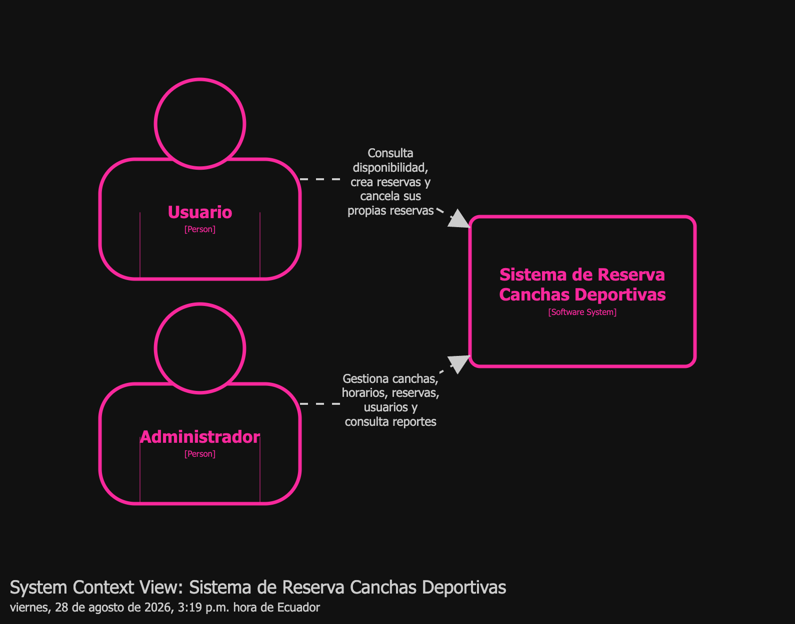

CanchasDeportivas no tendrá sistemas externos de terceros en su diagrama de Contexto: es un sistema autocontenido con dos personas que interactuarán directamente con él a través de la Aplicación Web.

> Tabla 4
>
> *Relaciones del diagrama de Contexto*

| Relación | Descripción |
|---|---|
| Usuario → Aplicación Web | Consulta disponibilidad, crea reservas y cancela únicamente sus propias reservas. |
| Administrador → Aplicación Web | Gestiona canchas, horarios, reservas de cualquier usuario y consulta reportes. |

### 5.2 Vista de Contenedores (C4 Nivel 2)

> Figura 2
>
> *Diagrama de Contenedores del sistema*

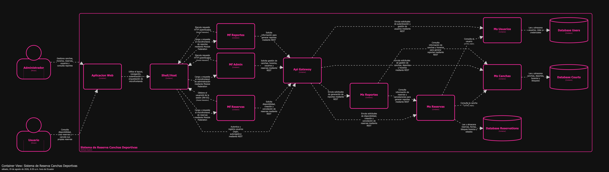

> Tabla 5
>
> *Contenedores del sistema y su responsabilidad*

| # | Contenedor | Responsabilidad | Dueño |
|---|---|---|---|
| 1 | Aplicación Web | Punto de entrada del navegador; usa el Shell/Host. | Brando |
| 2 | Shell/Host | Layout, routing, autenticación, registro público de usuarios, guards por rol; expone Session Store y Api Client federados. | Brando |
| 3 | Mf Reservas | Disponibilidad, nueva reserva y mis reservas (RN-01 a RN-06, RN-08). | Brando |
| 4 | Mf Admin | ABM de canchas y horarios (RN-07), panel global de reservas con cancelación admin (RN-03). | Brando |
| 5 | Mf Reportes | Ocupación por cancha y reservas por período. | Brando |
| 6 | Api Gateway | Punto único de entrada al sistema (Nginx); reenvía cada request al microservicio correspondiente o al Shell/Host. | Wilson |
| 7 | Ms Usuarios | Autenticación (emite JWT) y CRUD de usuarios/roles. | Cristian |
| 8 | Ms Canchas | CRUD de canchas, deportes y horarios de atención. | Cristian |
| 9 | Ms Reservas | Disponibilidad, creación y cancelación de reservas; valida contra Ms Canchas y Ms Usuarios. | Cristian |
| 10 | Ms Reportes | Agrega datos de Ms Canchas y Ms Reservas; sin base de datos propia. | Cristian |
| 11 | Bases de datos (Users/Courts/Reservations) | Persistencia por dominio, como schemas dentro de una única instancia Postgres (Sección 2.2, ADR-01 (Backend)). | Cristian |

### 5.3 – 5.11 Vistas de Componentes (C4 Nivel 3)

#### 5.3 Ms Usuarios

> Figura 3
>
> *Componentes internos de Ms Usuarios*

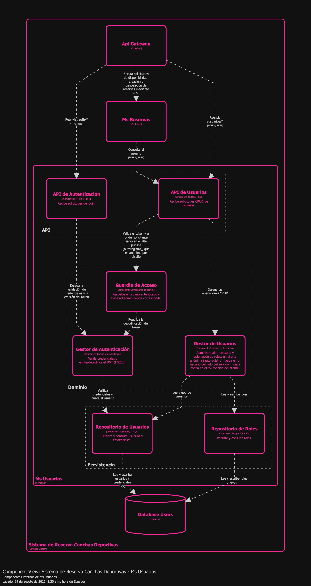

Separará el **Gestor de Autenticación** (emite y decodifica el JWT) del **Gestor de Usuarios** (CRUD y roles) porque son responsabilidades distintas: solo `ms-usuarios` firmará tokens, los otros tres microservicios únicamente los validarán (ADR-03 (Backend), Sección 7). La Guardia de Acceso resolverá el rol del solicitante reutilizando la decodificación del Gestor de Autenticación antes de dejar pasar cualquier operación CRUD administrativa — con la única excepción del alta pública (autoregistro, ADR-13 (Frontend)), que por definición es anónima y no puede exigir un token todavía inexistente. Para esa vía, el Gestor de Usuarios es quien asume la responsabilidad de seguridad: fuerza el rol "usuario" del lado del servidor sin importar qué rol reciba en la solicitud (Sección 6.2, cuarto punto).

#### 5.4 Ms Canchas

> Figura 4
>
> *Componentes internos de Ms Canchas*

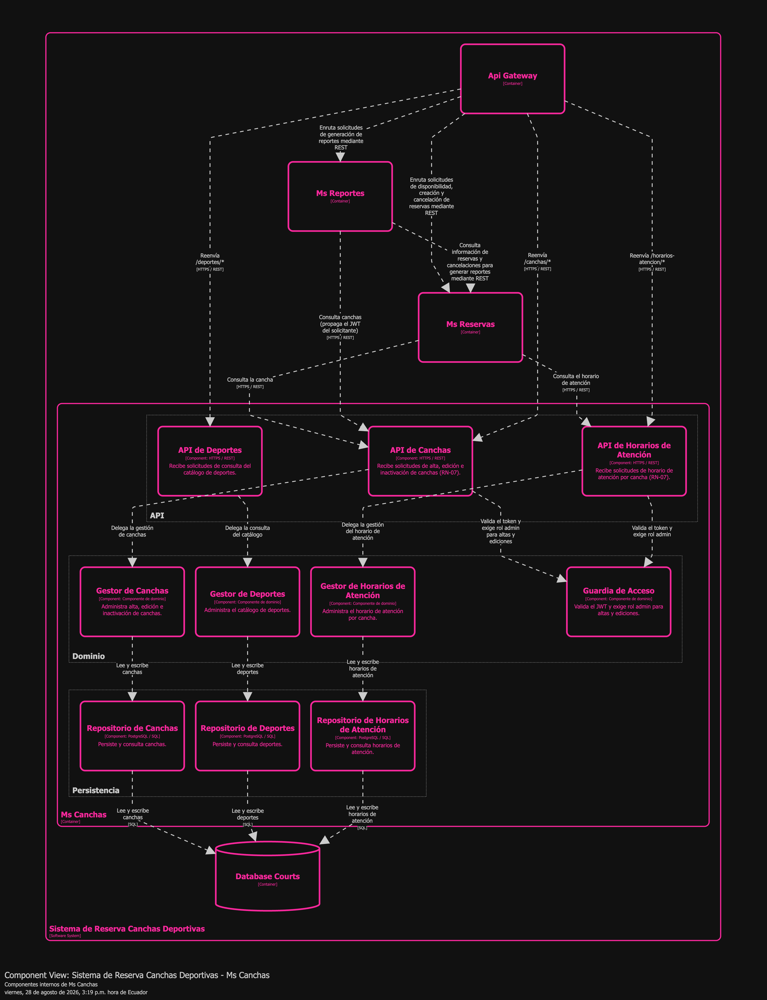

Tres gestores de dominio paralelos (Canchas, Deportes, Horarios de Atención) compartirán una misma Guardia de Acceso que exigirá rol admin para altas y ediciones — la materialización server-side de RN-07. Cada gestor tendrá su propio repositorio, persistiendo en el mismo schema `canchas` de la base compartida.

#### 5.5 Ms Reservas

> Figura 5
>
> *Componentes internos de Ms Reservas*

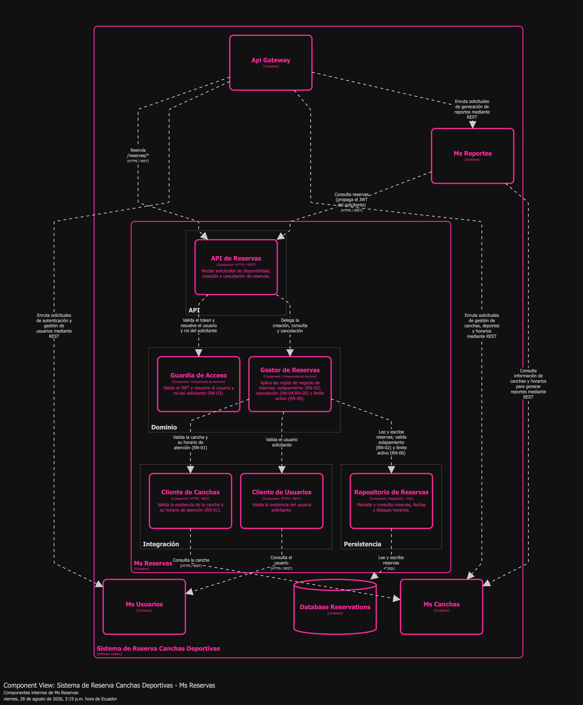

Es el contenedor con más responsabilidad de negocio del sistema: el Gestor de Reservas aplicará RN-02 (solapamiento), RN-04/RN-05 (cancelación y liberación de bloque) y RN-06 (límite activo) en un mismo punto, apoyándose en dos clientes de integración (Cliente de Canchas, Cliente de Usuarios) que validarán por HTTP síncrono contra los otros microservicios antes de persistir. Esta es, a la vez, la vista donde la arquitectura exige mayor cuidado de implementación: la validación de RN-02, visible en el diagrama como la flecha "valida solapamiento" hacia el Repositorio de Reservas, debe resolverse con el mecanismo atómico de base de datos que exige ADR-05 (Backend) — nunca como una consulta y luego una inserción en dos pasos separados (Sección 6.2).

#### 5.6 Ms Reportes

> Figura 6
>
> *Componentes internos de Ms Reportes*

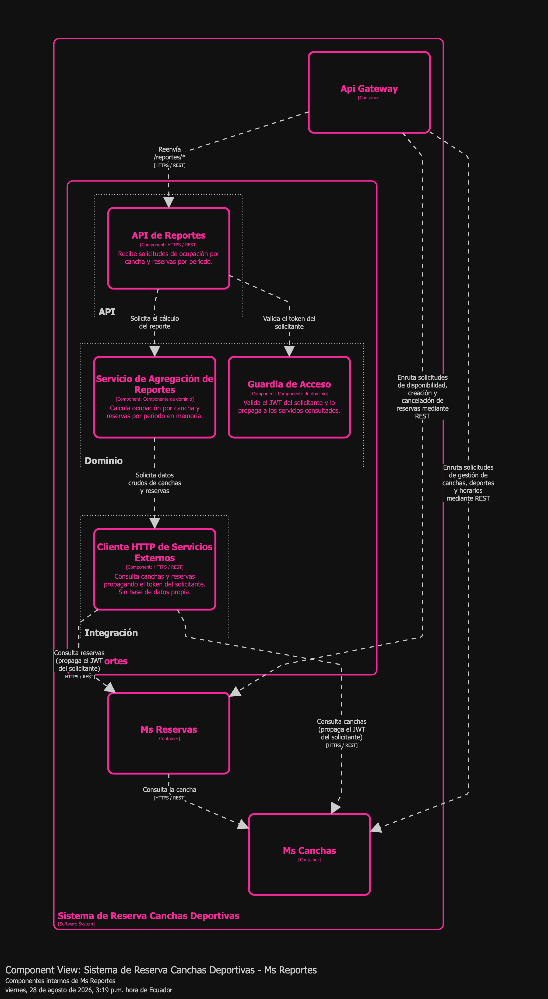

Deliberadamente no tendrá componente de Persistencia: el Servicio de Agregación de Reportes calculará todo en memoria a partir de lo que el Cliente HTTP de Servicios Externos traiga de Ms Canchas y Ms Reservas, propagando el JWT del solicitante en cada llamada saliente en vez de tener su propia lógica de autorización.

#### 5.7 Shell/Host

> Figura 7
>
> *Componentes internos del Shell/Host*

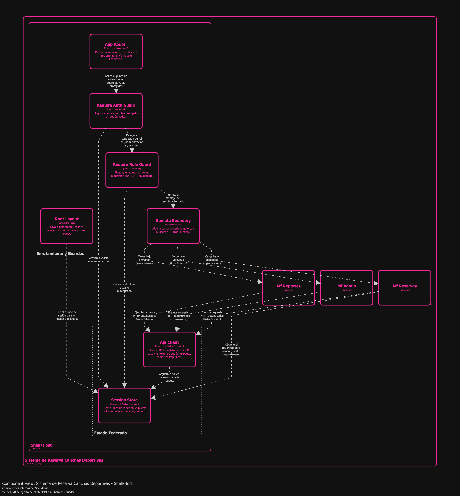

El Require Auth Guard y el Require Role Guard formarán una cadena de layout routes (ADR-08 (Frontend)): primero se exigirá sesión, después rol, y solo entonces el Remote Boundary montará el microfrontend correspondiente vía Module Federation. Session Store y Api Client serán los únicos dos componentes expuestos a los remotes — ninguna otra pieza del shell cruzará esa frontera (ADR-02 (Frontend)).

#### 5.8 Mf Reservas

> Figura 8
>
> *Componentes internos de Mf Reservas*

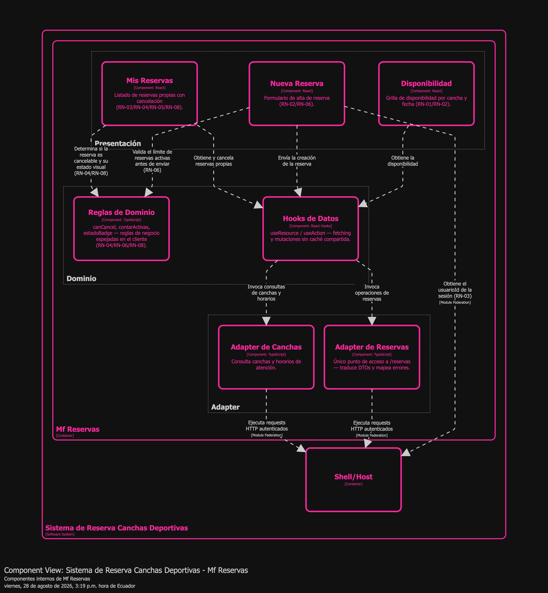

Las tres features de Presentación (Disponibilidad, Nueva Reserva, Mis Reservas) no accederán directo a HTTP: pasarán por Hooks de Datos, que a su vez delegarán en dos Adapters aislados (Reservas, Canchas) que serán el único punto del microfrontend que conoce el shape real del backend. Las Reglas de Dominio (RN-04/RN-06/RN-08) se consultarán desde Presentación, nunca desde el Adapter — mantiene la regla de negocio separada de la traducción de datos.

#### 5.9 Mf Admin

> Figura 9
>
> *Componentes internos de Mf Admin*

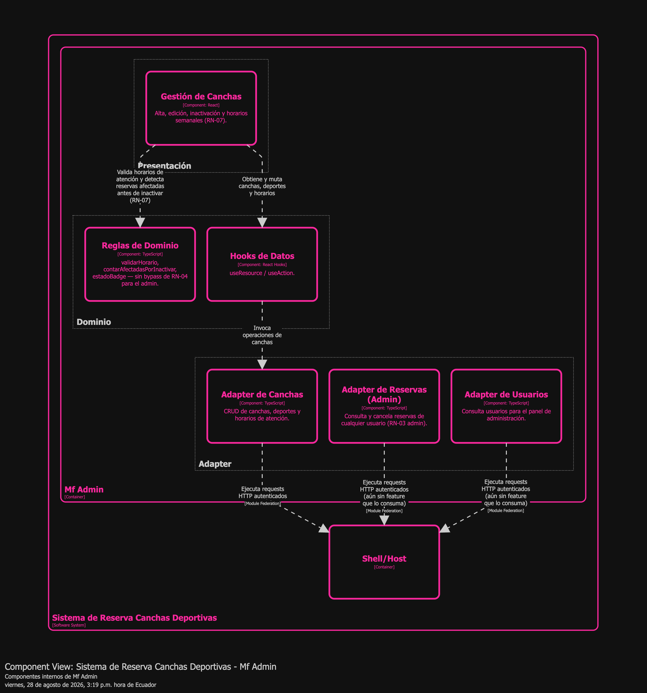

Mismo patrón en capas que Mf Reservas (Presentación → Dominio/Hooks → Adapter), aplicado a RN-07 y a la mitad administrativa de RN-03. El diseño contempla adapters separados para Canchas, Reservas (Admin) y Usuarios, cada uno consumido por su propia feature de Presentación — Gestión de Canchas, Gestión de Reservas y Gestión de Usuarios respectivamente.

#### 5.10 Mf Reportes

> Figura 10
>
> *Componentes internos de Mf Reportes*

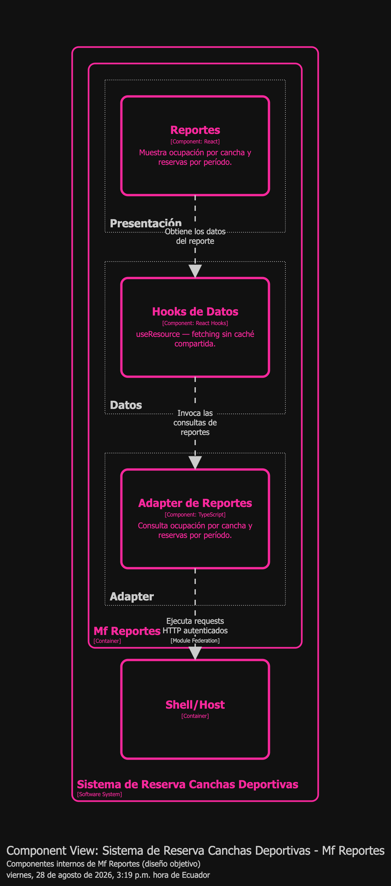

Seguirá el mismo patrón validado en las vistas 5.8 y 5.9 (Presentación → Hooks → Adapter): una feature de Reportes que consultará ocupación por cancha y reservas por período a través de un adapter dedicado, sin lógica de negocio adicional del lado del cliente.

#### 5.11 Api Gateway

> Figura 11
>
> *Componentes internos del Api Gateway*

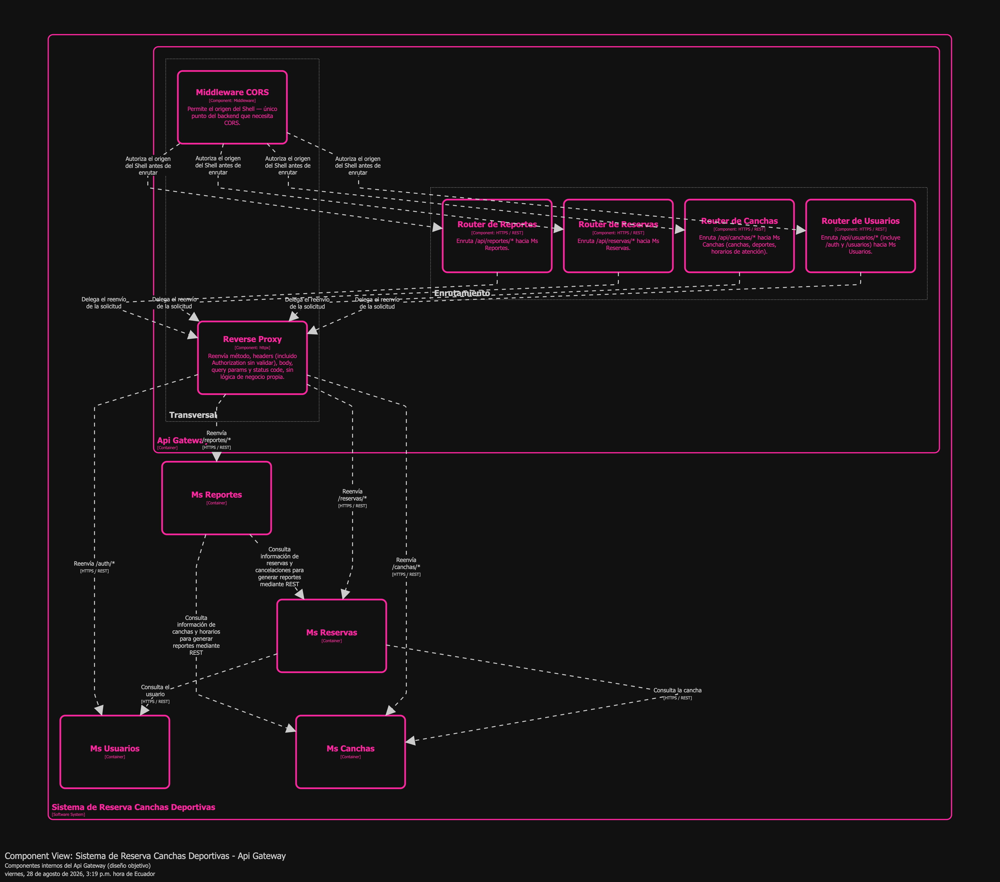

El Api Gateway se implementa con **Nginx** como reverse proxy, no como un microservicio propio — decisión que reemplaza la alternativa de FastAPI que la guía del curso dejaba abierta (ADR-14 (Gateway), Sección 7). El diagrama traduce a componentes el contrato de rutas acordado por el equipo: cinco *locations* (una por microservicio, con el detalle de que la de Usuarios cubre dos prefijos, `/auth` y `/usuarios`, más una quinta que reenvía el resto del tráfico al Shell/Host). Al ser Nginx el único punto al que el navegador le habla directo, ningún microservicio necesita CORS — cae la necesidad del middleware que la propuesta original contemplaba. Nginx reenvía el header `Authorization` tal cual, sin revalidarlo, porque los 4 microservicios ya lo validan de forma independiente (ADR-03 (Backend)).

---

## 6. Consistencia y Relaciones entre Vistas

### 6.1 Matriz de Trazabilidad RN → ADR → Contenedor

> Tabla 6
>
> *Matriz de trazabilidad RN → ADR → Contenedor*

| RN | Descripción | ADR relacionado | Contenedor(es) que lo implementan |
|---|---|---|---|
| RN-01 | Reserva sobre cancha, fecha y bloque horario predefinido | ADR-02 (Backend) (validación síncrona contra Ms Canchas), ADR-04 (Backend) | Ms Reservas (Gestor de Reservas, Cliente de Canchas); Ms Canchas (API de Canchas, API de Horarios de Atención); Mf Reservas (Disponibilidad) |
| RN-02 | No permite reservar un bloque ya ocupado (solapamiento) | **ADR-05 (Backend) — exige mecanismo atómico de base de datos** | Ms Reservas (Gestor de Reservas, Repositorio de Reservas); Mf Reservas (Nueva Reserva) |
| RN-03 | Usuario cancela solo sus reservas; admin cancela cualquiera | ADR-03 (Backend) (rol en JWT), ADR-08 (Frontend) (guards), ADR-02 (Frontend) (sesión federada) | Shell (Require Role Guard); Ms Reservas (Guardia de Acceso); Mf Reservas (Mis Reservas); Mf Admin (Adapter de Reservas Admin) |
| RN-04 | No cancelar una reserva ya iniciada | ADR-12 (Frontend) (bloqueo duro en cliente, sin bypass admin) | Mf Reservas (Reglas de Dominio, Mis Reservas); Mf Admin (Reglas de Dominio); Ms Reservas (Gestor de Reservas) |
| RN-05 | Cancelar libera el bloque automáticamente | ADR-04 (Backend) | Ms Reservas (Gestor de Reservas, Repositorio de Reservas) |
| RN-06 | Límite configurable de reservas activas simultáneas | ADR-12 (Frontend) (solo informativo, no gate — el límite es config del servidor) | Ms Reservas (Gestor de Reservas); Mf Reservas (Nueva Reserva, Reglas de Dominio) |
| RN-07 | Solo el admin crea/edita/inactiva canchas y define horario de atención | ADR-08 (Frontend) (guard de rol), ADR-04 (Backend) | Mf Admin (Gestión de Canchas); Ms Canchas (API de Canchas, API de Horarios, Guardia de Acceso) |
| RN-08 | Toda reserva tiene estado: Confirmada, Cancelada o Finalizada | — | Ms Reservas (Gestor de Reservas); Mf Reservas y Mf Admin (Reglas de Dominio — `estadoBadge`) |

No se detectan contenedores huérfanos (sin RN asociada) entre los que tendrán lógica de negocio propia. Api Gateway y Mf Reportes quedan fuera de esta matriz porque su diseño de componentes no deriva de una regla de negocio propia, sino del contrato de enrutamiento y agregación que consumirán.

### 6.2 Análisis de Consistencia entre Vistas

Las vistas son mutuamente consistentes en su modelado: cada relación de la Vista de Contenedores (5.2) tendrá su contraparte de menor nivel en alguna Vista de Componentes (5.3–5.11) — por ejemplo, `Ms Reservas → Ms Canchas` en 5.2 se refina en 5.5 como dos flechas puntuales del Cliente de Canchas hacia la API de Canchas y la API de Horarios de Atención, sin contradecirla.

Existen, sin embargo, **cuatro puntos de diseño que requieren una decisión explícita**, en vez de dejarlos librados a la implementación:

**Primera — RN-02 exige un mecanismo atómico de concurrencia, no una validación en dos pasos.** El Usuario final tiene como concern explícito que "no permitir un bloque ya ocupado" sea una garantía real (Sección 3), y es además la regla con mayor peso en la rúbrica del curso. Por eso la arquitectura no admite implementar la validación de solapamiento en `Ms Reservas` como una consulta seguida de una inserción en dos pasos separados (*check-then-act*): dos transacciones concurrentes podrían pasar ambas la validación antes de que cualquiera confirme el cambio, resultando en una doble reserva. ADR-05 (Backend) fija como requisito no negociable el uso de un mecanismo atómico a nivel de base de datos — `SELECT ... FOR UPDATE`, un constraint `EXCLUDE`, o un `UNIQUE` sobre `(cancha_id, fecha, hora_inicio)` — de modo que el nivel de aislamiento por defecto de Postgres (`READ COMMITTED`) no sea, por sí solo, insuficiente para sostener la regla.

**Segunda — el Api Gateway es el único punto de entrada, y ya está resuelto.** La Vista de Contenedores (5.2) dibuja `Mf Reservas/Mf Admin/Mf Reportes/Shell → Api Gateway → Ms */Shell` como el flujo real de tráfico: el Api Gateway (Nginx, ADR-14 (Gateway)) expone el mismo contrato de rutas que el proxy de desarrollo del Shell replicaba de forma transitoria (ADR-01 (Frontend)), así que la migración fue transparente para el frontend, tal como estaba previsto por diseño. El proxy de desarrollo sigue siendo válido para levantar el frontend sin Docker.

**Tercera — el secreto de JWT compartido es un trade-off de seguridad aceptado por simplicidad, no una omisión.** ADR-03 (Backend) decide que los 4 microservicios compartan un secreto HS256 simétrico en vez de introducir una validación centralizada o un esquema asimétrico. Esto implica que cualquiera de los 4 microservicios podría, en principio, emitir tokens válidos para cualquier usuario y rol, no solo validarlos — HS256 no distingue "puedo verificar" de "puedo firmar". La arquitectura acepta este trade-off por la simplicidad que aporta al no requerir infraestructura de validación centralizada, pero exige como condición no negociable que el secreto se gestione exclusivamente por variable de entorno, nunca comitteado al repositorio, y deja abierta la migración a un algoritmo asimétrico (RS256/ES256) si el Api Gateway llega a centralizar la validación.

**Cuarta — el registro público de usuarios exige validación server-side del rol y credenciales hasheadas, no puede delegarse solo en el cliente.** El shell incorpora una pantalla de autoregistro que reutiliza el mismo endpoint de alta de `Ms Usuarios` pensado originalmente para gestión administrativa. Del lado del cliente, el rol queda fijo en "usuario" y el formulario nunca ofrece seleccionar rol — una mitigación de UX, no un control de seguridad, porque el cliente nunca es una frontera de confianza: cualquier llamado directo a la API que no pase por ese formulario podría, en principio, enviar cualquier `rol_id`. Por eso la arquitectura exige, sin excepción, que `Ms Usuarios` valide server-side que el alta pública solo pueda crear usuarios con rol "usuario" — nunca confiar en el valor recibido del cliente — y que las credenciales se persistan con un algoritmo de hashing, nunca en texto plano. Esto excede el alcance de lo que este documento puede resolver por sí solo, porque la implementación pertenece al bloque de backend (regla dura de convención, Sección 1.2), pero se declara aquí sin atenuantes por la misma razón que el resto de esta sección — para que la implementación lo resuelva explícitamente, no lo herede como deuda oculta.

---

## 7. Justificación Arquitectónica (Rationale)

### 7.1 Tabla Resumen de Decisiones Arquitectónicas

> Tabla 7
>
> *Resumen de decisiones arquitectónicas*

| ADR | Estado | Decisión | Alternativas Consideradas | Justificación (Rationale) |
|---|---|---|---|---|
| ADR-01 (Backend) | Aceptada | Un schema Postgres por dominio dentro de una única base compartida | Base de datos física separada por microservicio | Más simple de operar en Docker Compose para un equipo sin infraestructura dedicada; a cambio, concentra el riesgo de disponibilidad de los tres dominios con persistencia en una única instancia (Sección 2.2). |
| ADR-02 (Backend) | Aceptada | Comunicación síncrona REST/`httpx` entre microservicios | Eventos asíncronos con vista local cacheada en `ms-reservas` | Simplicidad y consistencia fuerte al momento de validar cancha/usuario, sin infraestructura de mensajería adicional; a cambio, sin retry ni circuit breaker, una caída de `ms-usuarios`/`ms-canchas` haría fallar la creación de reserva en cascada. |
| **ADR-03 (Backend)** ★ | Aceptada | JWT HS256 con secreto compartido, validado de forma independiente por cada microservicio | RS256 asimétrico; validación centralizada en el futuro Gateway | Evita una llamada de red extra a `ms-usuarios` por cada request; a cambio, exige que el secreto se gestione exclusivamente por variable de entorno, nunca comitteado, dado que un secreto simétrico compartido habilita a cualquier microservicio a emitir tokens, no solo a validarlos (Sección 6.2, tercer punto). |
| ADR-04 (Backend) | Aceptada | Arquitectura en capas uniforme (`api/core/db/models/repositories/schemas/services`) en los 4 microservicios | Arquitectura hexagonal explícita | Consistencia de navegación entre los 4 `ms-*` sin la ceremonia adicional que un proyecto de este alcance no justificaría. |
| **ADR-05 (Backend)** ★ | Aceptada | Exigir un mecanismo atómico de base de datos para la validación de solapamiento (RN-02) | Validación en aplicación sin mecanismo atómico (descartada por riesgo de condición de carrera) | RN-02 es la regla de mayor peso en la rúbrica del curso; aceptar una validación no atómica expondría al sistema a una doble reserva bajo uso concurrente real, exactamente lo que la regla prohíbe (Sección 6.2, primer punto). |
| ADR-06 (Backend) | Aceptada | Orquestar con Docker Compose en etapas: primero la base de datos, containerización completa de los 4 microservicios después | Containerizar todo desde el arranque del proyecto | Permite iterar más rápido en las primeras etapas de desarrollo (sin rebuild de imagen por cada cambio de código), postergando la complejidad de orquestación completa a cuando el resto de los bloques esté más estable. |
| ADR-01 (Frontend) | Aceptada | Proxy same-origin del dev-server del shell en vez de CORS en el backend | Habilitar `CORSMiddleware` en los 4 `ms-*` | Evita configuración de CORS en el bloque de otro compañero; el prefijo `/api/<servicio>` será exactamente el contrato que el Gateway de Wilson deberá replicar (Sección 6.2, segundo punto). |
| **ADR-02 (Frontend)** ★ | Aceptada | Sesión y cliente HTTP federados en runtime desde el shell (`shell/session`, `shell/apiClient`) | Paquete `packages/session` compartido en el workspace, importado en build-time | Una sola fuente de verdad de sesión sin riesgo de que un remote quede en una versión vieja del paquete tras una instalación desincronizada; a cambio, acopla el arranque de los remotes a que el shell exponga su manifest. |
| ADR-08 (Frontend) | Aceptada | Guards de ruta (`RequireAuth`, `RequireRole`) como layout routes con `<Outlet/>` | Envolver manualmente cada página protegida | Una ruta nueva agregada dentro de una sección protegida nacerá protegida por herencia estructural, sin depender de que alguien recuerde envolverla. |
| **ADR-09 (Frontend)** ★ | Aceptada | Capa adapter/DTO aislada + MSW para el endpoint de disponibilidad mientras se coordina su contrato definitivo con backend | Bloquear el desarrollo del microfrontend hasta que el endpoint exista; fetch directo sin capa de mapeo | Permite desarrollar y testear la UI sin bloquear al bloque de frontend por una dependencia cruzada; si el contrato real termina siendo distinto al propuesto, el único punto de cambio será el mapper del adapter, sin tocar componentes de UI. |
| ADR-12 (Frontend) | Aceptada | Reglas de negocio en cliente: solo se espeja lo computable sin estado del servidor (bloqueo duro para RN-04, informativo para RN-06) | Espejar también RN-06 como bloqueo duro, hardcodeando el límite configurado en backend | Evita que la UI le mienta al usuario sobre una regla cuyo valor real vive y puede cambiar solo en el servidor; a cambio, el usuario podrá completar un formulario entero antes de enterarse del rechazo por límite. |
| **ADR-13 (Frontend)** ★ | Aceptada, con riesgo residual declarado | Autoregistro público (`/registro`) con `rol_id` fijo en el cliente, sin selector de rol | No ofrecer autoregistro (alta de usuarios solo por admin); exponer un selector de rol en el formulario | Habilita autoservicio sin bloquear al usuario final por falta de un flujo administrativo de alta; a cambio, es una mitigación solo de UI — no reemplaza una validación server-side que hoy no existe en `ms-usuarios` (Sección 6.2, cuarto punto), por lo que no debe considerarse un control de seguridad real. |
| ADR-14 (Gateway) | Aceptada | Api Gateway implementado con Nginx como reverse proxy, en vez de un microservicio FastAPI propio | Api Gateway como microservicio FastAPI (alternativa que dejaba abierta la guía del curso) | Nginx resuelve el enrutamiento y el reenvío de headers sin escribir ni mantener código propio para una responsabilidad puramente de infraestructura; a cambio, la lógica de ruteo queda en configuración declarativa en vez de código versionado con tests, y cualquier regla más compleja que un simple reenvío (rate limiting, transformación de payload) exigiría revisar esa decisión. |

---

### 7.2 ADR-03 (Backend): JWT HS256 con secreto compartido, validado de forma independiente

#### Status

Aceptada

#### Context

No existirá, en una primera etapa, un API Gateway que centralice la validación de autenticación. Mientras tanto, cada uno de los 4 microservicios necesita saber, de forma independiente, si un request viene de un usuario autenticado y con qué rol.

#### Decision

`ms-usuarios` emitirá un JWT firmado con HS256 (`{sub: usuario_id, rol, exp}`). Los demás microservicios (`ms-canchas`, `ms-reservas`, `ms-reportes`) validarán ese mismo token de forma independiente, cada uno con su propia copia del `SECRET_KEY` simétrico, sin consultar a `ms-usuarios` en cada request.

#### Consequences

Validación local y rápida, sin punto de fallo síncrono adicional a los ya descritos en ADR-02 (Backend) — es el patrón estándar de JWT stateless. El costo es de seguridad, no de rendimiento: al ser HS256 simétrico compartido entre los 4 microservicios, cualquiera de ellos podría emitir tokens válidos para cualquier usuario y rol, no solo validarlos — HS256 no distingue "puedo verificar" de "puedo firmar". La arquitectura exige por eso que el secreto se gestione exclusivamente por variable de entorno, nunca comitteado al repositorio. Un algoritmo asimétrico (RS256/ES256) con clave privada solo en `ms-usuarios` eliminaría ese riesgo, y queda como evolución posible si el Api Gateway llega a centralizar la validación. Tampoco habrá revocación prevista: un token filtrado seguirá siendo válido hasta su expiración. Este es el riesgo de seguridad más relevante del diseño (RNF-04, RNF-05) y se declara sin atenuantes en la Sección 6.2.

---

### 7.3 ADR-05 (Backend): Mecanismo atómico de base de datos para la validación de solapamiento (RN-02)

#### Status

Aceptada

#### Context

RN-02 ("no permite reservar un bloque horario ya ocupado en la misma cancha") tiene peso alto en la rúbrica del curso. Si la validación de existencia de solapamiento y la inserción de la nueva reserva se implementan como dos pasos separados — primero consultar, después insertar —, dos transacciones concurrentes podrían pasar ambas la validación antes de que cualquiera confirme el cambio.

#### Decision

Se exige que la validación de solapamiento se resuelva de forma atómica, con alguno de los siguientes mecanismos a nivel de base de datos: `SELECT ... FOR UPDATE` sobre las reservas del mismo bloque antes de insertar; un constraint `EXCLUDE` (con `tsrange`/`btree_gist`) que impida directamente la superposición de rangos horarios; o un `UNIQUE` sobre `(cancha_id, fecha, hora_inicio)`. Cualquiera de los tres es aceptable; lo que la arquitectura no admite es una validación en dos pasos sin ninguno de estos mecanismos.

#### Consequences

El nivel de aislamiento por defecto de Postgres (`READ COMMITTED`) no previene por sí solo una condición de carrera de tipo *check-then-act*, por lo que el mecanismo elegido deberá implementarse explícitamente, no asumirse como comportamiento por defecto. Es la regla de mayor peso en la rúbrica del curso, lo que hace esta exigencia más relevante, no menos: una condición de carrera es más probable que se manifieste bajo uso concurrente real que en pruebas manuales secuenciales, por lo que una implementación que "funciona en la demo" no será evidencia suficiente de que RN-02 esté correctamente resuelta. Queda como el punto de mayor prioridad de la Sección 6.2.

---

### 7.4 ADR-02 (Frontend): Sesión y cliente HTTP federados desde el shell

#### Status

Aceptada

#### Context

Los 3 remotes (`mf-reservas`, `mf-administracion`, `mf-reportes`) necesitarán leer la sesión del usuario logueado y hacer llamadas HTTP autenticadas. Module Federation permite dos caminos: un paquete npm compartido en el workspace (build-time) o exponer módulos del shell en runtime vía `exposes`.

#### Decision

El shell expondrá `./session`, `./apiClient` y `./contract` como remotes federados en runtime (`shell/session`, `shell/apiClient`). Los microfrontends los consumirán igual que cualquier otro remote de Module Federation, sin depender de un paquete instalado en `node_modules`.

#### Consequences

Un solo build del shell definirá la verdad de sesión/HTTP; no habrá riesgo de que un remote quede en una versión vieja del paquete tras una instalación desincronizada, y ningún remote armará sus propios headers de autenticación ni decidirá reglas de acceso — eso será responsabilidad exclusiva del shell (`SessionStore`, `RequireRole`), lo que sostiene directamente el concern de "autoridad del servidor" de la Sección 3. El costo es de acoplamiento de arranque: si el shell no expone su manifest de Module Federation, ningún remote podrá montar sesión ni HTTP — mitigado con una estrategia de carga que aísle a cada remote bajo demanda, de modo que uno caído no tumbe a los demás. También exigirá disciplina de contrato estable en el módulo compartido: cambiar la forma de `./session` rompería a los 3 remotes a la vez.

---

### 7.5 ADR-09 (Frontend): Capa adapter/DTO aislada + MSW para el endpoint de disponibilidad

#### Status

Aceptada

#### Context

Al diseñar `mf-reservas`, el endpoint `GET /reservas/disponibilidad` es una propuesta del frontend hacia el bloque de backend, no un endpoint construido todavía. La convención dura del equipo prohíbe implementar código fuera del propio bloque, incluso como spike temporal de validación — por lo que no es una opción esperar a que el endpoint exista para empezar a construir la UI.

#### Decision

Toda la interacción con `ms-reservas`/`ms-canchas` pasará por adapters (`reservasApi`, `canchasApi`) que devuelven DTOs propios del frontend, mapeados desde el JSON crudo del backend. MSW servirá el endpoint de disponibilidad con el shape propuesto mientras el bloque de backend lo implementa. Ningún componente de UI conocerá la forma cruda de la respuesta HTTP — es, en efecto, el mismo rol que cumple un Anti-Corruption Layer frente a un backend inestable, aplicado aquí no contra un sistema legado sino contra un contrato todavía en negociación entre dos bloques del mismo equipo.

#### Consequences

Si el contrato real del endpoint termina siendo distinto al propuesto — por ejemplo, si el backend expone una lista cruda de reservas en vez de una grilla ya armada de libre/ocupado —, el único punto de cambio deberá ser el mapper del adapter, sin tocar ningún componente de presentación. Es la misma garantía que ofrece un Anti-Corruption Layer frente a un contrato en negociación, aplicada aquí contra una dependencia cruzada entre dos bloques del mismo equipo que avanzan en paralelo. El costo es temporal, no arquitectónico: mientras el mock y el endpoint real no coincidan, habrá que mantener ambos shapes sincronizados hasta poder apagar el mock. El riesgo que la arquitectura no puede eliminar por sí sola es de disciplina: si algún componente importa el módulo crudo del adapter en vez de pasar por sus DTOs, se pierde el aislamiento — por eso deberá sostenerse por convención de carpetas y revisión de código, no solo por diseño.

---

### 7.6 ADR-13 (Frontend): Autoregistro público con rol fijo en el cliente

#### Status

Aceptada, con riesgo residual declarado

#### Context

El shell incorpora una pantalla de autoregistro que reutiliza el endpoint de alta de `Ms Usuarios` pensado originalmente para gestión administrativa (Sección 5.2, fila 11). Ninguna RN (01–08) exige esta pantalla; se agrega como conveniencia de UX para no depender de que un admin dé de alta a cada usuario final a mano.

#### Decision

El formulario de autoregistro fija el rol en "usuario" del lado del cliente y nunca expone un selector de rol — de modo que, navegando la UI, es imposible autoasignarse el rol administrador.

#### Consequences

Esta es una mitigación de UI, no un control de seguridad: el cliente nunca es una frontera de confianza, así que fijar el rol en el formulario no reemplaza la validación que el backend debe aplicar de forma independiente (Sección 6.2, cuarto punto) — el alta pública debe crear usuarios exclusivamente con rol "usuario" a nivel servidor, sin confiar en lo que el cliente envíe, y las credenciales deben persistirse con hashing. Eso excede lo que este ADR puede resolver, porque la implementación pertenece al bloque de backend — la regla dura de convención del equipo (Sección 1.2) prohíbe implementarla desde este lado. Mientras esa validación server-side no esté garantizada, `ADR-13 (Frontend)` reduce la superficie de ataque solo para quien use la UI, no para quien hable con la API directamente.
