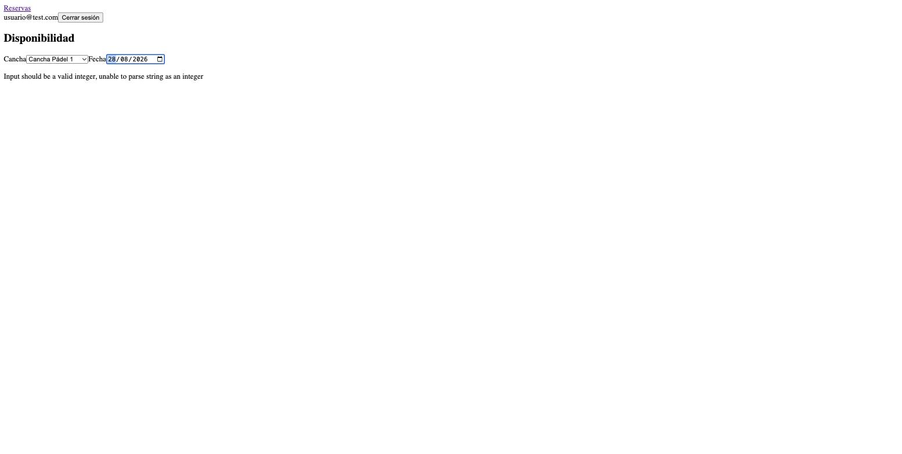

# Informe: Flujo real de reservas — Change `mf-reservas-booking`

**Proyecto**: Sistema de Reserva de Canchas Deportivas
**Responsable**: Brando (bloque frontend)
**Fecha**: 27 de agosto de 2026
**Metodología**: Spec-Driven Development (SDD) con asistencia de Claude Code
**Artefactos completos**: `openspec/changes/archive/2026-08-27-mf-reservas-booking/`

---

## 1. Objetivo

Reemplazar el placeholder de `mf-reservas` (heredado de la change anterior `frontend-shell`) por su flujo de negocio real: consultar disponibilidad, crear una reserva y gestionar las propias (cancelar, ver estado). A diferencia del esqueleto inicial, acá entran en juego las reglas de negocio del proyecto (RN-01 a RN-08) y una dependencia real de otro compañero de equipo.

## 2. El obstáculo de partida: falta un endpoint

Antes de poder diseñar la pantalla principal (disponibilidad de una cancha por fecha), la exploración encontró que **el backend no expone ningún endpoint que permita ver bloques ocupados de otros usuarios** — `GET /reservas/` solo devuelve las reservas propias. Sin esto, no hay forma real de pintar una grilla de "libre/ocupado".

Acá se tomó una decisión de proceso importante: en vez de implementar el endpoint faltante nosotros mismos en `backend/` (que es el bloque de Cristian, no el nuestro), se armó un **spike de validación** — se implementó el endpoint por unas horas, con tests, para confirmar que la idea era técnicamente viable — y después **se revirtió por completo**, dejando en su lugar una propuesta formal y documentada para que Cristian decida si la implementa (`docs/propuestas/ms-reservas-endpoint-disponibilidad.md`). El resto de esta change se construyó contra ese contrato *propuesto*, mockeado con MSW, no contra un endpoint real.

Esto quedó guardado como regla explícita para el resto del proyecto: **nunca modificar código de `backend/` o `apigateway/` sin que el dueño de ese bloque lo pida** — ni siquiera como spike temporal.

## 3. Las fases y qué produjo cada una

Se repitió el mismo ciclo completo que en `frontend-shell` (`explore → propose → spec → design → tasks → apply → verify → archive`), esta vez con menos fricción porque varias decisiones de la change anterior (arquitectura del shell, convenciones de test) ya estaban resueltas.

### Decisiones clave de la propuesta

| Decisión | Por qué |
|---|---|
| Capa adapter (`src/api/`) separada de las pantallas | Cuando el gateway de Wilson exista y cambie paths/shapes, solo se toca un archivo — la UI nunca se entera. |
| Sin TanStack Query, hooks propios (`useResource`/`useAction`) | Bajo Module Federation, compartir un `QueryClient` exigiría volverlo singleton en el shell y los 3 remotes — tocar `shell/` por cero beneficio real con 4 endpoints. |
| Errores: mostrar `detail` del backend tal cual, decidir flujo por `status` | El backend no tiene códigos de error machine-readable, solo strings en español — parsear texto para decidir lógica es frágil; mostrarlo es gratis y da mejor UX que "Error 400". |
| RN-04 espejado duro en cliente, RN-06 solo informativo | RN-04 (no cancelar reservas ya iniciadas) es computable con datos que el cliente ya tiene. RN-06 (límite de reservas activas) vive en una env var del backend que el frontend no ve — hardcodear el número podría bloquear reservas legítimas. |

### Implementación (10 fases, 36 tareas, TDD estricto)

1. **Infraestructura**: instalación de MSW y validación de que funciona sobre jsdom (spike bloqueante, pasó sin problemas).
2. **Adapter**: DTOs propios, mappers, `mapApiError`.
3. **Domain rules**: `canCancel` (RN-04) — a propósito replica el mismo criterio de timezone que usa el backend, para que el botón se deshabilite exactamente cuando el backend rechazaría.
4. **Hooks**: `useResource`/`useAction`, livianos, con `AbortController` por request.
5. **Componentes compartidos**: `ErrorBanner`, `EstadoBadge`.
6-8. **Las 3 pantallas**: Disponibilidad, Nueva reserva, Mis reservas.
9. **Integración**: reemplazo del placeholder, y una auditoría de capas encontró y corrigió una violación real (un test importaba un tipo interno del adapter directamente, rompiendo el aislamiento que la propia change había diseñado).
10. **Verificación global**: suite completa, build, auditoría de cobertura de specs.

### Verificación y archivo

`sdd-verify` dio **PASS, 0 CRITICAL**. Los únicos 2 warnings eran sobre cómo se había *redactado* un hallazgo (no sobre el código) y se corrigieron antes de archivar. Las 2 specs se mergearon a `openspec/specs/`.

## 4. Cuándo fue SDD y cuándo no

A diferencia de `frontend-shell`, esta vez **no hubo bugs reales de código** que exigieran debugging exploratorio de la implementación en sí — la disciplina de TDD y los aprendizajes documentados de la change anterior (por ejemplo, el gotcha de que ningún test puede instanciar su propio `setupServer()` de MSW) se aplicaron desde el arranque y evitaron ese tipo de sorpresas.

Lo que sí quedó fuera del proceso estructurado, por naturaleza:

- **El spike del endpoint backend**: una decisión de "probemos si esto funciona" fuera de cualquier spec, seguida de una corrección de proceso ("no tocamos backend/") que también fue una negociación en tiempo real, no algo planeado.
- **Las idas y vueltas del `git push`**: qué ramas usar, si pushear directo a `main` o por PR, qué carpetas incluir, si subir `.env` real — todo esto se resolvió a los tumbos, con el usuario corrigiendo el rumbo varias veces, no con una spec previa.
- **La validación manual final en el navegador** (sección siguiente): confirmar con datos reales que el flujo de cancelación funciona de punta a punta contra el backend de Cristian, sin mocks.

## 5. Evidencia — flujo real contra el backend

Todas las capturas de esta sección son de la app corriendo contra `ms-usuarios`, `ms-canchas` y `ms-reservas` reales (sin MSW) — la suite de tests automatizados sí usa MSW, esto es la confirmación manual de que el mismo código funciona en producción real.

### Pantalla de Disponibilidad — selector con datos reales

Las canchas (`Cancha Pádel 1`, `Cancha Pádel 2`, etc.) vienen de `ms-canchas` real, no de un fixture.

### El límite documentado, en vivo

Al elegir una cancha y fecha, la grilla falla con un error real del backend — porque el endpoint de disponibilidad todavía no existe (ver sección 2). El mensaje se muestra tal cual lo devuelve FastAPI, sin ocultarlo: es exactamente el comportamiento que la propuesta anticipó, no una sorpresa.

### Mis reservas — datos reales seedeados

Tres reservas reales del usuario de prueba, con sus estados reales (RN-08) y el botón Cancelar ya deshabilitado en la que está Cancelada.

### Cancelación real, de punta a punta

Clickear "Cancelar" dispara un `PATCH /reservas/{id}/cancelar` real contra `ms-reservas` — la reserva pasa a "Cancelada" y su botón se deshabilita solo, sin ningún mock de por medio.

## 6. Resultados medibles

| Métrica | Resultado |
|---|---|
| Tareas completadas | 36/36 (10 fases) |
| Tests automatizados | 67 en `mf-reservas` (144 entre las 4 apps del frontend) |
| Cobertura de escenarios de spec | 17/18 con test explícito |
| Build de producción | Exit 0 en las 4 apps |
| Violaciones de arquitectura encontradas y corregidas | 1 (acoplamiento a un tipo interno del adapter) |
| Hallazgos CRITICAL en la verificación final | 0 |
| Cambios directos a `backend/`/`apigateway/` | 0 (el spike se revirtió) |

## 7. Qué sigue

- **Bloqueante real**: el endpoint de disponibilidad sigue sin existir en el backend. La propuesta para Cristian está lista (`docs/propuestas/ms-reservas-endpoint-disponibilidad.md`); hasta que la implemente (o decida no hacerlo), la pantalla de Disponibilidad seguirá fallando contra el backend real tal como se ve en la sección 5.
- `mf-administracion` y `mf-reportes` siguen siendo placeholders — son los próximos changes candidatos.
- El API Gateway de Wilson sigue sin existir — cuando lo tenga, la capa adapter de esta change (pensada justo para esto) debería absorber el cambio sin tocar las pantallas.
