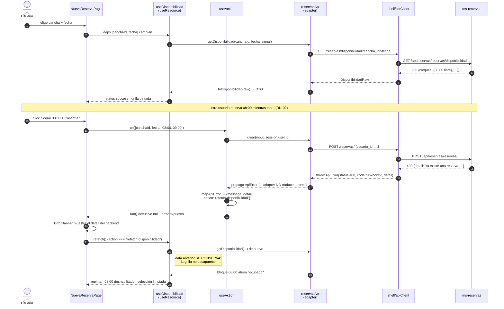

# Design: mf-reservas — flujo real de reservas

Fase `sdd-design`. Entrada: `proposal.md` (aprobada) + `exploration.md`. Alcance: **CÓMO** se construye. La lista de tareas es `sdd-tasks`.

---

## 1. Arquitectura en una pantalla

```
features/  disponibilidad · nueva-reserva · mis-reservas      (React: pantallas)
    │  usa DTOs camelCase, nunca conoce paths ni snake_case
    ├────────────► domain/rules.ts     (funciones puras: RN-04, RN-06, badges)
    ├────────────► hooks/              (useResource · useAction: loading/error/refetch)
    ▼
api/       reservasApi · canchasApi                            (ADAPTER — la costura)
    │  ÚNICO lugar con: paths reales · raw.ts (snake_case) · mappers · mapApiError
    ▼
shell/apiClient                                                (transporte: host + auth)
    ▼  fetch same-origin /api/{service}/**
proxy Rsbuild del shell ──► ms-reservas :8003 · ms-canchas :8002
```

| Capa | Puede importar | Prohibido |
|------|----------------|-----------|
| `api/` | `shell/apiClient` | React, `features/`, `domain/` |
| `domain/` | tipos de `api/dto` | React, `api/*Api`, `Date.now()` implícito |
| `hooks/` | `api/errors` | paths, DTOs concretos |
| `features/` | `api` (barrel), `domain`, `hooks` | `api/raw`, `shell/apiClient` directo |

Regla dura: **`src/api/raw.ts` no se importa desde ningún archivo fuera de `src/api/`**. Es el test de si el desacople del gateway (Wilson) se sostiene.

**Paths reales** (`apiClient` arma `/api/{service}` + `path`; el proxy borra el prefijo):

| Operación | Llamada | URL en el browser |
|-----------|---------|-------------------|
| Listar reservas propias | `get("/reservas/", {service:"reservas"})` | `/api/reservas/reservas/` |
| Crear | `post("/reservas/", body, …)` | `/api/reservas/reservas/` |
| Cancelar | `patch("/reservas/{id}/cancelar", undefined, …)` | `/api/reservas/reservas/7/cancelar` |
| Disponibilidad ⚠️ | `get("/reservas/disponibilidad", {query})` | `/api/reservas/reservas/disponibilidad` |
| Canchas | `get("/canchas", {service:"canchas"})` | `/api/canchas/canchas` |

El doble segmento `reservas/reservas` es correcto: el prefijo del proxy y el prefix del router de FastAPI coinciden por nombre. ⚠️ = endpoint **propuesto, no implementado** (`docs/propuestas/ms-reservas-endpoint-disponibilidad.md`).

---

## 2. Contratos: DTOs y mapeo

```ts
// src/api/dto.ts — lo que consumen features/ y domain/
export type IsoDate = string;  // "YYYY-MM-DD"
export type IsoTime = string;  // "HH:mm:ss"
export type EstadoReserva = "Confirmada" | "Cancelada" | "Finalizada";
export type EstadoBloque  = "libre" | "ocupado";

export interface Reserva {
  readonly id: number;
  readonly usuarioId: number;
  readonly canchaId: number;
  readonly fecha: IsoDate;
  readonly horaInicio: IsoTime;
  readonly horaFin: IsoTime;
  /** null ⇒ estado no reconocido (privilegio mínimo: sin acciones). */
  readonly estado: EstadoReserva | null;
  /** Valor crudo, solo para mostrar cuando `estado` es null. */
  readonly estadoRaw: string;
}

export interface Cancha { readonly id: number; readonly nombre: string;
  readonly deporteId: number; readonly activa: boolean; }

export interface BloqueDisponibilidad { readonly horaInicio: IsoTime;
  readonly horaFin: IsoTime; readonly estado: EstadoBloque; }

export interface Disponibilidad { readonly canchaId: number; readonly fecha: IsoDate;
  readonly bloques: readonly BloqueDisponibilidad[]; }

export interface NuevaReservaInput { readonly canchaId: number; readonly fecha: IsoDate;
  readonly horaInicio: IsoTime; readonly horaFin: IsoTime; }
```

```ts
// src/api/raw.ts — shape crudo del backend. NADIE fuera de src/api/ lo importa.
export interface ReservaRaw { id: number; usuario_id: number; cancha_id: number;
  fecha: string; hora_inicio: string; hora_fin: string; estado: string;
  created_at: string; updated_at: string; }
export interface CanchaRaw { id: number; nombre: string; deporte_id: number;
  activo: boolean; created_at: string; updated_at: string; }
export interface BloqueRaw { hora_inicio: string; hora_fin: string; estado: string; }
export interface DisponibilidadRaw { cancha_id: number; fecha: string; bloques: BloqueRaw[]; }

// src/api/mappers.ts — funciones puras, testeables sin red
export function toReserva(raw: ReservaRaw): Reserva;
export function toCancha(raw: CanchaRaw): Cancha;
export function toDisponibilidad(raw: DisponibilidadRaw): Disponibilidad;
export function toReservaCreateBody(input: NuevaReservaInput, usuarioId: number): {
  usuario_id: number; cancha_id: number; fecha: string;
  hora_inicio: string; hora_fin: string; };
```

Reglas del mapeo:
- `created_at`/`updated_at` **se descartan**: ninguna pantalla los usa; mapear campos muertos es deuda.
- `estado` pasa por `normalizeEstado(raw): EstadoReserva | null` — mismo patrón que `normalizeRol` del shell (ADR-06 de `frontend-shell`): valor desconocido ⇒ `null`, nunca throw, sin acciones habilitadas.
- `toDisponibilidad` normaliza `estado` de bloque igual: cualquier cosa que no sea `"libre"` se trata como `"ocupado"` (fail-safe: nunca ofrecer como libre algo que no se entiende).
- `usuario_id` del POST **sale de `session.user.id`**, no de un input del formulario (RN-03: el backend responde 403 si no coinciden).

### Decisión: fechas/horas como strings, nunca `Date` en el DTO

**Alternativas**: (a) `Date` en el DTO, (b) `Temporal`/date-fns, (c) strings + helper explícito ← elegida.
**Rationale**: el backend compara `datetime.combine(fecha, hora_inicio) <= datetime.now()` con datetimes **naive** interpretados como UTC. Un `new Date("2026-08-28T10:00:00")` en JS se parsea en **hora local** — el botón Cancelar quedaría habilitado/deshabilitado distinto según el timezone del usuario, y divergiría del 400 real del backend. El string es transporte inerte; la única conversión vive en `domain/rules.ts` (§5) y es explícita.

---

## 3. `mapApiError` — status manda, `detail` se muestra

```ts
// src/api/errors.ts
import type { ApiError } from "shell/apiClient";

export type ErrorAction = "refetch-disponibilidad" | "retry" | "none";

export interface UiError {
  readonly message: string;   // texto mostrable al usuario
  readonly action: ErrorAction;
  readonly status: number;    // 0 si no hubo respuesta HTTP
}

/** Duck-typing, NO instanceof: bajo Module Federation la clase ApiError puede
 *  venir de otra instancia de módulo y `instanceof` daría false. */
export function isApiError(e: unknown): e is ApiError {
  return e instanceof Error && e.name === "ApiError";
}

export function mapApiError(error: unknown): UiError;
```

| Discriminador | `message` | `action` | Por qué |
|---|---|---|---|
| `status === 400` | `error.detail` **verbatim** | `refetch-disponibilidad` | El backend manda RN-01/02/06 en español; distinguir solapamiento vs. límite no cambia la acción correcta (refrescar + mostrar el motivo). `code` es `"unknown"` en 400 ⇒ **inutilizable**, por eso se ramifica por `status`. |
| `status === 403` | `"No tenés permiso para operar sobre esta reserva."` | `none` | RN-03. `detail` del backend es interno; mensaje propio. |
| `status === 404` | `"La reserva o la cancha ya no existe."` | `none` | Reintentar no sirve. |
| `status === 422` | `error.detail` (ya aplanado por `apiClient`) | `none` | Error de forma: es bug nuestro o input inválido, no del servidor. |
| `status === 401` | `"Tu sesión expiró."` | `none` | El shell ya disparó logout global; mf-reservas no navega. |
| `status >= 500` | `"El servidor no pudo procesar la solicitud. Probá de nuevo."` | `retry` | Transitorio. |
| `status === 0 && code === "network"` | `"No se pudo conectar con el servidor."` | `retry` | Backend caído / offline. |
| `status === 0 && code === "aborted"` | `"La solicitud tardó demasiado."` | `retry` | Timeout de 15 s. |
| `!isApiError(error)` | `"Ocurrió un error inesperado."` | `none` | Bug de JS: no inventar semántica HTTP. |

Consumo: `ErrorBanner` renderiza `message` y muestra el botón "Reintentar" **solo** si `action === "retry"`. `NuevaReservaPage` reacciona a `action === "refetch-disponibilidad"` llamando `disponibilidad.refetch()` (§4/§6). Ningún componente ramifica por `status` ni por texto.

---

## 4. `useResource` / `useAction` — fetching propio (sin TanStack Query)

```ts
// src/hooks/useResource.ts
export type ResourceStatus = "idle" | "loading" | "success" | "error";

export interface Resource<T> {
  readonly data: T | null;      // se CONSERVA durante un refetch (no parpadea)
  readonly error: UiError | null;
  readonly status: ResourceStatus;
  readonly refetch: () => void; // identidad estable (useCallback)
}

export function useResource<T>(
  fetcher: (signal: AbortSignal) => Promise<T>,
  deps: readonly unknown[],           // primitivos, longitud fija
  options?: { enabled?: boolean },    // default true
): Resource<T>;
```

Semántica (≈45 LOC):
1. Efecto disparado por `[...deps, version, enabled]`. `enabled:false` ⇒ `status:"idle"`, no dispara nada (la pantalla de disponibilidad sin cancha/fecha elegida).
2. `AbortController` por ejecución; se aborta en cambio de `deps` y en unmount, y se pasa a `apiClient` vía `options.signal` ⇒ **elimina la carrera de respuestas fuera de orden** (una respuesta vieja no puede pisar a una nueva).
3. Un error con `code:"aborted"` originado por nuestro propio abort **se ignora** (no es un error de usuario); se distingue con un flag `cancelled` local del efecto.
4. `refetch()` incrementa un `version` interno ⇒ re-corre el efecto **conservando `data`** (`status:"loading"` con `data !== null` ⇒ la grilla se repinta sin desmontarse).
5. `fetcher` vive en un **ref** actualizado en cada render y NO entra en las deps del efecto: si entrara, una lambda inline re-dispararía el fetch en cada render (loop infinito). Este es el footgun principal del hook y va documentado en el archivo.

```ts
// src/hooks/useAction.ts — mutaciones (POST/PATCH), ≈30 LOC
export interface Action<TArgs, TResult> {
  readonly run: (args: TArgs) => Promise<TResult | null>; // null si falló
  readonly pending: boolean;
  readonly error: UiError | null;
  readonly reset: () => void;
}
export function useAction<TArgs, TResult>(
  fn: (args: TArgs) => Promise<TResult>,
): Action<TArgs, TResult>;
```

`run` **nunca throwea**: captura, pasa por `mapApiError`, expone `error` y devuelve `null`. Así el `onSubmit` del formulario es lineal (`if (creada === null) return;`) sin `try/catch` en la capa de UI.

### Consumo por pantalla

| Pantalla | Recursos | Mutación | Post-éxito |
|---|---|---|---|
| **Disponibilidad** | `useResource(canchasApi.list, [])` · `useDisponibilidad(canchaId, fecha)` | — | — |
| **Nueva reserva** | `useDisponibilidad(canchaId, fecha)` (instancia propia) · `useResource(reservasApi.listMias, [])` para el contador RN-06 | `useAction(reservasApi.crear)` | `misReservas.refetch()` + `disponibilidad.refetch()` |
| **Mis reservas** | `useResource(reservasApi.listMias, [])` | `useAction(reservasApi.cancelar)` | `refetch()` |

`useDisponibilidad(canchaId, fecha)` (`features/disponibilidad/useDisponibilidad.ts`) envuelve `useResource` + `reservasApi.getDisponibilidad`. **Cada pantalla tiene su propia instancia, sin caché compartida** — es exactamente el costo de no usar TanStack Query, y a esta escala (2 consumidores, refetch explícito) es aceptable.

### Decisión: sin caché compartida entre pantallas

**Alternativas**: (a) `QueryClient` singleton federado, (b) Context propio con caché, (c) instancia por pantalla ← elegida.
**Rationale**: (a) obliga a declarar el `QueryClient` como `singleton` en el shell y en los 3 remotes ⇒ tocar `shell/` (fuera de alcance). (b) reinventa TanStack Query mal. (c) cuesta un request extra al navegar entre pantallas; con 4 endpoints es invisible. Se reevalúa si `mf-reportes` necesita cruce de datos.

---

## 5. RN-04 client-side: reloj y pureza

```ts
// src/domain/rules.ts — sin React, sin imports de api/*Api
/** "2026-08-28" + "10:00:00" → epoch ms interpretando el par como UTC.
 *  Parseo manual con Date.UTC: `new Date("2026-08-28T10:00:00")` sería HORA LOCAL. */
export function toUtcMillis(fecha: IsoDate, hora: IsoTime): number;

/** RN-04: el bloque ya arrancó. `<=` — arrancar exacto YA cuenta como iniciada. */
export function hasStarted(
  r: { fecha: IsoDate; horaInicio: IsoTime },
  nowMs: number = Date.now(),
): boolean;

/** Cancelar habilitado ⇔ estado Confirmada Y no inició. `estado === null` ⇒ false. */
export function canCancel(r: Reserva, nowMs: number = Date.now()): boolean;

export function contarActivas(reservas: readonly Reserva[]): number; // RN-06, informativo
export function estadoBadge(estado: EstadoReserva | null): { label: string; tone: string };
```

**Reloj**: `nowMs` es un parámetro opcional con default `Date.now()`. No hay `ClockProvider` ni inyección por Context.

| Nivel de test | Cómo congela el reloj |
|---|---|
| Unit (`rules.test.ts`) | Pasa el epoch explícito: `canCancel(r, Date.UTC(2026,7,28,9,59))`. Determinístico sin tocar globals. |
| Componente (`MisReservasPage.test.tsx`) | `vi.setSystemTime(...)` en `beforeEach` + `vi.useRealTimers()` en `afterEach` — el componente llama `canCancel(r)` sin argumento y no hay forma de inyectar sin ensuciar la API pública del componente. |

**Rationale del default en vez de un `Clock` inyectado**: una sola regla depende del tiempo. Un provider de reloj sería andamiaje ceremonial para un caso; el parámetro opcional da 100% de testabilidad determinística en la capa donde vive la lógica, y `vi.setSystemTime` cubre el resto.

**Gotcha documentado**: espejamos el backend **bug incluido**. El backend compara datetimes naive contra `now(UTC)`, así que una reserva "10:00" se evalúa como 10:00 UTC (07:00 en Argentina). Si el cliente usara hora local, el botón y el 400 discreparían. Cuando Cristian corrija el timezone, se corrige `toUtcMillis` — **un solo archivo**.

---

## 6. Diagrama de secuencia — RN-02: disponibilidad → POST → 400 → repintado



Invariante: **el POST es la única fuente de verdad**. La grilla es una foto que puede quedar vieja entre el GET y el POST; el 400 es el mecanismo de reconciliación, no una excepción a manejar.

---

## 7. Estructura de carpetas

```
frontend/apps/mf-reservas/src/
├── api/
│   ├── raw.ts             # shapes snake_case del backend (privado del módulo)
│   ├── dto.ts             # Reserva · Cancha · Disponibilidad · BloqueDisponibilidad
│   ├── mappers.ts         # toReserva / toCancha / toDisponibilidad / toReservaCreateBody
│   ├── errors.ts          # UiError · ErrorAction · isApiError · mapApiError
│   ├── reservasApi.ts     # listMias · getDisponibilidad · crear · cancelar
│   ├── canchasApi.ts      # list (+ getHorariosAtencion, solo si aplica el plan B)
│   └── index.ts           # barrel: única superficie que importan features/
├── domain/
│   └── rules.ts           # toUtcMillis · hasStarted · canCancel · contarActivas · estadoBadge
├── hooks/
│   ├── useResource.ts
│   └── useAction.ts
├── components/
│   ├── ErrorBanner.tsx    # message + Reintentar condicionado por action
│   └── EstadoBadge.tsx    # compartido mis-reservas ↔ disponibilidad
├── features/
│   ├── disponibilidad/    # DisponibilidadPage · useDisponibilidad · BloquesGrid · CanchaFechaPicker
│   ├── nueva-reserva/     # NuevaReservaPage · ReservaForm
│   └── mis-reservas/      # MisReservasPage · ReservaRow
├── mocks/                 # solo tests: handlers.ts · server.ts · fixtures.ts · session.ts
├── config/env.ts          # sin cambios
├── App.tsx                # <Routes> RELATIVO (el shell monta "/reservas/*")
└── bootstrap.tsx          # sin cambios
```

Tests colocados junto al archivo (`rules.test.ts` al lado de `rules.ts`), como ya hace el resto del monorepo.

Rutas internas de `App.tsx` (el shell ya declara `path="/reservas/*"` en `AppRouter.tsx:56`, así que el splat existe): `index` → Disponibilidad, `nueva` → Nueva reserva, `mias` → Mis reservas.

### Decisión: el endpoint pendiente se aísla en `reservasApi.getDisponibilidad`

**Choice**: diseñar contra el contrato propuesto y mockearlo con MSW; el DTO `Disponibilidad` es la costura.
**Alternativas**: (a) esperar a Cristian (bloquea la change), (b) implementar ya el modo degradado con `horarios-atencion`.
**Rationale**: si Cristian no lo implementa, el **plan B** cambia **solo el cuerpo de `getDisponibilidad`** (derivar bloques de 1 h desde `GET /horarios-atencion` y marcarlos todos `"libre"`). Cero cambios en pantallas, hooks, tests de UI o `domain/`. Implementarlo ahora sería escribir código que probablemente se tira.

---

## 8. Cambios de archivos

| Archivo | Acción | Descripción |
|---|---|---|
| `src/api/**` (7 archivos) | Create | Adapter completo. |
| `src/domain/rules.ts` | Create | RN-04/RN-06 puras. |
| `src/hooks/{useResource,useAction}.ts` | Create | Fetching/mutación. |
| `src/components/{ErrorBanner,EstadoBadge}.tsx` | Create | UI compartida. |
| `src/features/**` | Create | 3 pantallas. |
| `src/mocks/**` | Create | MSW (solo tests). |
| `src/App.tsx` | Modify | Sub-router relativo en lugar del placeholder. |
| `src/RemoteHealthCard.tsx` + `.test.tsx` | Delete | Path `/mias` inexistente. |
| `setupTests.ts` | Modify | Ciclo de vida de `setupServer`. |
| `vitest.config.ts` | Modify | Solo agrega `environmentOptions.jsdom.url`. **El bloque `resolve.alias` no se toca.** |
| `package.json` | Modify | `msw` como devDependency. |
| `frontend/apps/shell/**` | **Sin cambios** | Invariante de la change. |

---

## 9. MSW y convivencia con el setup existente

```ts
// src/mocks/handlers.ts — un handler por endpoint, en el espacio de URL del BROWSER
export const handlers = [
  http.get("/api/canchas/canchas", …),
  http.get("/api/reservas/reservas/", …),
  http.get("/api/reservas/reservas/disponibilidad", …),  // ⚠️ contrato propuesto
  http.post("/api/reservas/reservas/", …),
  http.patch("/api/reservas/reservas/:id/cancelar", …),
];

// Escenarios de error como factories, para server.use(...) por test
export const errorScenarios = {
  crear400: (detail: string) => http.post(…, () => HttpResponse.json({ detail }, { status: 400 })),
  cancelar403: () => …, notFound404: () => …, unprocessable422: () => …,
  networkDown: () => http.get(…, () => HttpResponse.error()),
};
```

| Punto | Decisión | Por qué |
|---|---|---|
| Espacio de URL | Handlers sobre `/api/{service}/**`, **no** sobre `http://localhost:8003` | MSW intercepta `fetch` en el browser, **antes** del proxy del dev-server. Mockear la URL del microservicio no matchearía nunca. |
| `onUnhandledRequest` | `"error"` en `server.listen()` | Un path mal escrito falla el test en vez de devolver silencio. Es exactamente la clase de bug del `/mias` actual. |
| Ciclo de vida | `listen` en `beforeAll`, `resetHandlers` en `afterEach`, `close` en `afterAll` | Los overrides por test no se filtran entre archivos. |
| Sesión | `src/mocks/session.ts` → `seedSession()` usa `getOrCreateSessionStore().set({user, token})` de `shell/session` | **Gotcha crítico**: `apiClient` corta el request con `ApiError{status:0, code:"unauthorized"}` si `authorizeRequest` devuelve `null`. Sin sembrar sesión, MSW **nunca ve el request** y todos los tests fallan por la razón equivocada. |
| Aliases | `resolve.alias` de `vitest.config.ts` intacto | Los alias `shell/session` y `shell/apiClient` son lo que hace que los tests ejerciten el **`apiClient` real** — precisamente el motivo de elegir MSW sobre mockear `fetch`. Romperlos vacía de sentido la decisión 5 de la propuesta. |
| Scope | `msw` como devDependency **solo de `mf-reservas`** | `pnpm -r test` sigue corriendo shell, mf-administracion y mf-reportes sin MSW cargado. |

**Riesgo abierto**: MSW v2 usa globals de red (`Request`/`Response`/`TransformStream`/`BroadcastChannel`) que jsdom no siempre provee completos. Si `setupServer` falla al arrancar bajo `environment: "jsdom"`, la mitigación es un `environment` custom que preserve los globals de Node, o polyfills en `setupTests.ts`. **Debe validarse con un spike de 1 test antes de escribir los ~10 casos de error** — va como primera tarea de la fase de testing en `sdd-tasks`.

---

## 10. Estrategia de testing (TDD estricto, `pnpm -r test`)

| Capa | Qué se testea | Cómo |
|---|---|---|
| Unit — `mappers.ts` | snake_case → DTO, `estado` desconocido → `null`, descarte de timestamps | Objetos planos, sin red |
| Unit — `errors.ts` | Las 9 filas de la tabla §3, incluido no-`ApiError` | Fabricar `ApiError` a mano |
| Unit — `rules.ts` | `canCancel` con epoch explícito: antes / exacto / después; estado ≠ Confirmada; `null` | Sin globals |
| Integración — `hooks` | `enabled:false`, refetch conserva `data`, abort en cambio de deps, `run()` no throwea | `renderHook` + MSW |
| Integración — features | 3 pantallas × (happy path + error) | RTL + MSW + `user-event` |
| Integración — RN-02 | El flujo completo de §6: 200 → 400 → refetch → bloque ocupado | `server.use(errorScenarios.crear400(...))` y luego handler con el bloque ocupado |
| Integración — RN-04 | Cancelar deshabilitado con reloj congelado | `vi.setSystemTime` |
| E2E | — | Fuera de alcance (sin Playwright en el repo) |

Contra el backend real (`Success Criteria` de la propuesta): verificable **salvo** el criterio de disponibilidad, bloqueado hasta la decisión de Cristian.

---

## 11. Migración / rollout

No hay migración de datos. Sin feature flag: el `ErrorBoundary` por remote del shell ya aísla una caída de `mf-reservas`. Rollback = `git revert` + `pnpm install` (§Rollback Plan de la propuesta).

---

## 12. Preguntas abiertas

- [ ] **Bloqueante parcial** — ¿Cristian implementa `GET /reservas/disponibilidad`, lo cambia de forma o lo descarta? Impacta solo `getDisponibilidad` (§7).
- [ ] ¿El backend interpreta las horas como UTC a propósito o es un bug de timezone? Hoy lo espejamos tal cual (§5). Si se corrige, `toUtcMillis` es el único archivo a tocar.
- [ ] Spike MSW v2 + jsdom (§9): si los globals no alcanzan, definir mitigación antes de la fase de testing.
