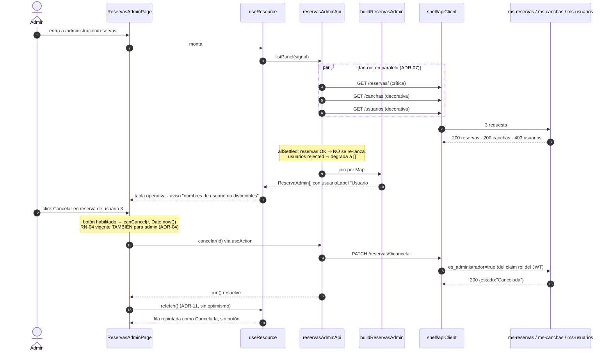

# Design: mf-administracion — panel de administración (RN-07 + RN-03 admin)

Fase `sdd-design`. Entrada: `proposal.md` (aprobada) + `exploration.md`. Alcance: **CÓMO** se construye. La lista de tareas es `sdd-tasks`.

> Este diseño **resuelve** los 3 riesgos que la propuesta dejó abiertos (inactivar con reservas futuras → ADR-03; fan-out de enrichment → ADR-07; `GET /reservas/` sin paginar → ADR-09) y agrega 3 hallazgos nuevos del backend leídos en esta fase (ADR-05, ADR-06, §10).

---

## 1. Arquitectura en una pantalla

Misma topología que `mf-reservas` (patrón ya validado), con un `api/` compartido por las dos features:

```
features/  canchas · reservas                            (React: pantallas)
    │  usa DTOs camelCase, nunca conoce paths ni snake_case
    ├────────────► domain/rules.ts    (puras: RN-04, badges, impacto de inactivar)
    ├────────────► domain/filters.ts  (puras: filtrado + contador N de M)
    ├────────────► hooks/             (useResource · useAction)
    ▼
api/  canchasApi · deportesApi · horariosApi · reservasAdminApi · usuariosApi
    │  ÚNICO lugar con: paths reales · raw.ts (snake_case) · mappers · mapApiError
    ▼
shell/apiClient                                          (transporte: host + auth)
    ▼  fetch same-origin /api/{service}/**
proxy Rsbuild del shell ──► ms-canchas :8002 · ms-reservas :8003 · ms-usuarios :8001
```

| Capa | Puede importar | Prohibido |
|------|----------------|-----------|
| `api/` | `shell/apiClient` | React, `features/`, `domain/` |
| `domain/` | tipos de `api/dto` | React, `api/*Api`, `Date.now()` implícito |
| `hooks/` | `api/errors` | paths, DTOs concretos |
| `features/` | `api` (barrel), `domain`, `hooks` | `api/raw`, `shell/apiClient` directo |

**Regla dura** (idéntica a `mf-reservas`): `src/api/raw.ts` no se importa desde ningún archivo fuera de `src/api/`. Es el test de si el desacople del futuro gateway de Wilson se sostiene.

### Paths reales (verificados leyendo los routers, no la memoria)

`apiClient` arma `/api/{service}` + `path`; el proxy borra el prefijo.

| Operación | Llamada | URL en el browser |
|---|---|---|
| Listar canchas | `get("/canchas", {service:"canchas"})` | `/api/canchas/canchas` |
| Crear cancha | `post("/canchas", body, …)` | `/api/canchas/canchas` |
| Editar / reactivar | `put("/canchas/{id}", body, …)` | `/api/canchas/canchas/7` |
| Inactivar | `patch("/canchas/{id}/inactivar", undefined, …)` | `/api/canchas/canchas/7/inactivar` |
| Deportes (selector) | `get("/deportes", …)` | `/api/canchas/deportes` |
| Horarios de una cancha | `get("/horarios-atencion", {query:{cancha_id}})` | `/api/canchas/horarios-atencion?cancha_id=7` |
| Crear / editar horario | `post("/horarios-atencion")` · `put("/horarios-atencion/{id}")` | `/api/canchas/horarios-atencion` |
| Todas las reservas | `get("/reservas/", {service:"reservas"})` | `/api/reservas/reservas/` |
| Cancelar (admin) | `patch("/reservas/{id}/cancelar", undefined, …)` | `/api/reservas/reservas/7/cancelar` |
| Usuarios (enrichment) | `get("/usuarios", {service:"usuarios"})` | `/api/usuarios/usuarios` |

⚠️ **Gotcha de trailing slash**: los routers de `ms-canchas` y `ms-usuarios` declaran el path de colección como `""` (⇒ `/canchas`, `/usuarios`, sin barra final), mientras que `ms-reservas` lo declara como `"/"` (⇒ `/reservas/`, **con** barra). No es un capricho de estilo: escribir mal la barra produce un redirect 307 o un 404. Los paths viven en un solo lugar (`api/*Api.ts`) precisamente por esto.

Rutas internas: el shell ya monta `path="/administracion/*"` dentro de `<RequireRole rol="administrador">` (`shell/src/app/AppRouter.tsx:60-69`), así que el splat existe y `App.tsx` usa un `<Routes>` **relativo** — igual que `mf-reservas/src/App.tsx`. Cero cambios en el shell.

---

## 2. Contratos: DTOs y mapeo

```ts
// src/api/dto.ts — lo que consumen features/ y domain/
export type IsoDate = string;  // "YYYY-MM-DD"
export type IsoTime = string;  // "HH:mm:ss"
export type EstadoReserva = "Confirmada" | "Cancelada" | "Finalizada";

export interface Cancha  { id: number; nombre: string; deporteId: number; activa: boolean; }
export interface Deporte { id: number; nombre: string; descripcion: string | null; activo: boolean; }
export interface HorarioAtencion {
  id: number; canchaId: number; diaSemana: number; // ISO 1-7 (1=lunes)
  horaInicio: IsoTime; horaFin: IsoTime; activo: boolean;
}
export interface Reserva {
  id: number; usuarioId: number; canchaId: number; fecha: IsoDate;
  horaInicio: IsoTime; horaFin: IsoTime;
  estado: EstadoReserva | null;  // null ⇒ no reconocido: sin acciones
  estadoRaw: string;
}
export interface Usuario { id: number; nombre: string; apellido: string; email: string; activo: boolean; }

/** DTO de VISTA: resultado del join client-side (ADR-08). */
export interface ReservaAdmin extends Reserva {
  canchaLabel: string;   // "Cancha Central" | "Cancha #7" si degradó
  usuarioLabel: string;  // "Ana Pérez" | "Usuario #3" si degradó
}

export interface CanchaInput  { nombre: string; deporteId: number; }
export interface HorarioInput { canchaId: number; diaSemana: number; horaInicio: IsoTime; horaFin: IsoTime; }
```

`raw.ts` replica los shapes snake_case verificados en los schemas Pydantic: `CanchaRaw{id,nombre,deporte_id,activo,created_at,updated_at}`, `DeporteRaw{id,nombre,descripcion,activo}`, `HorarioAtencionRaw{id,cancha_id,dia_semana,hora_inicio,hora_fin,activo}`, `ReservaRaw{…,estado,created_at,updated_at}`, `UsuarioRaw{id,nombre,apellido,email,telefono,rol_id,activo}`.

Reglas del mapeo (idénticas a `mf-reservas`):
- `created_at`/`updated_at`/`telefono`/`rol_id` **se descartan**: ninguna pantalla los usa; mapear campos muertos es deuda.
- `estado` pasa por `normalizeEstado(raw)`: valor desconocido ⇒ `null`, nunca throw, sin acciones habilitadas (privilegio mínimo, ADR-06 de `frontend-shell`).
- Fechas/horas viajan como **strings**, nunca `Date`. Ver ADR-02.

### Bodies de escritura — asimetría deliberada create/update

```ts
toCanchaCreateBody(input): { nombre, deporte_id }              // CanchaCreate NO acepta `activo`
toCanchaUpdateBody(input, activo?): { nombre?, deporte_id?, activo? }  // CanchaUpdate SÍ
toHorarioCreateBody(input): { cancha_id, dia_semana, hora_inicio, hora_fin }
toHorarioUpdateBody(input): { hora_inicio, hora_fin }          // ver ADR-06: NUNCA dia_semana
```

---

## 3. ADRs

### ADR-01 — Un remote, router interno, dos features

**Choice**: `/administracion/canchas` y `/administracion/reservas` dentro del único `./App` que ya expone `rsbuild.config.ts:55`.
**Alternativas**: dos remotes MF independientes.
**Rationale**: un segundo remote exige puerto, `rsbuild.config.ts`, entrada en `AppRouter.tsx` y `.env` nuevos, y rompe la convención de 4 apps del CLAUDE.md, para cero beneficio a esta escala. Ratifica la Decisión 1 de la propuesta.

### ADR-02 — Duplicar `rules.ts` y los hooks; NO extraer `packages/shared`

**Choice**: copiar `toUtcMillis`/`hasStarted`/`canCancel`/`estadoBadge` y `useResource`/`useAction` desde `mf-reservas`, con un comentario cruzado en ambos archivos.
**Alternativas**: `packages/shared` en el workspace.
**Rationale**: extraer hoy obliga a tocar `pnpm-workspace.yaml`, 4 `tsconfig` y los builds de 4 apps por ~60 LOC de funciones puras. **Trigger explícito de extracción**: tercer consumidor (`mf-reportes`) o corrección del timezone en el backend. El gotcha de UTC (`Date.UTC` manual, nunca `new Date("…T…")`) se copia **textual, bug incluido**: el backend compara `datetime.combine(...).replace(tzinfo=utc)` contra `now(utc)` (`reserva_service.py:226-239`), así que el cliente debe interpretar el par fecha+hora como UTC o el botón y el 400 real discreparían según el timezone del admin.

### ADR-03 — Inactivar una cancha: advertencia informada, NUNCA bloqueo — **riesgo resuelto**

**Hallazgo verificado**: `CanchaService.inactivar` (`backend/ms-canchas/app/services/cancha_service.py:149-178`) hace **solo** `cancha.activo = False`. No hay cascada, no hay validación, no consulta `ms-reservas`. Las reservas `Confirmada` futuras de esa cancha **sobreviven intactas**. Del otro lado, `ReservaService.create` (`reserva_service.py:67-79`) sí rechaza reservas **nuevas** sobre cancha inactiva ("La cancha está inactiva").

⇒ Semántica real de inactivar: **"no se aceptan reservas nuevas"**, no "se cancelan las existentes".

**Choice**: el diálogo de confirmación carga `GET /reservas/`, cuenta con la función pura `contarAfectadasPorInactivar(reservas, canchaId, nowMs)` (reservas `Confirmada` de esa cancha que **todavía no iniciaron**) y muestra:
> "Esta cancha tiene **3 reservas confirmadas a futuro**. Inactivarla impide nuevas reservas pero **no cancela** las existentes. Revisá el panel de reservas si querés cancelarlas." + link a `/administracion/reservas?cancha=7`.

Se inactiva igual si el admin confirma.
**Alternativas**: (a) bloquear la inactivación si hay reservas futuras; (b) cancelarlas en cascada desde el cliente; (c) no decir nada.
**Rationale**: (a) inventa una regla que el backend no tiene — el admin quedaría bloqueado en la UI para algo que un `curl` permite, y enseñaría una regla falsa (mismo criterio que RN-04 en ADR-04 de `mf-reservas`). (b) es un bucle de N `PATCH /cancelar` desde el cliente, no transaccional, con fallos parciales imposibles de deshacer: eso es una decisión de backend, no de UI, y además tocaría datos de otros usuarios sin que nadie lo pidió. (c) deja al admin creyendo que "desactivé la cancha" equivale a "liberé la agenda". Además la operación es **reversible** (ADR-05), así que el costo de equivocarse es bajo y no justifica un bloqueo.
**Degradación**: si el `GET /reservas/` del diálogo falla, se muestra "No se pudo verificar si hay reservas afectadas" y el botón Inactivar **sigue habilitado**. Un fallo de lectura no puede vetar una operación de escritura legítima.

### ADR-04 — RN-04 sin bypass para admin

**Choice**: `canCancel(r, nowMs)` idéntico a `mf-reservas`: habilitado ⇔ `estado === "Confirmada"` **y** el bloque no inició. Sin excepción por rol.
**Rationale verificado**: `ReservaService.cancelar` aplica RN-04 **después** del bypass de dueño (`reserva_service.py:222-239`) — `es_administrador` saltea el chequeo de propiedad, no el de tiempo. Habilitar el botón "porque es admin" produciría un 400 garantizado. Bonus: el backend también rechaza cancelar una ya `Cancelada` (línea 217) y una `Finalizada` cae por RN-04; `estado !== "Confirmada" ⇒ false` cubre ambos casos sin ramificar.

### ADR-05 — Reactivar una cancha vía `PUT /canchas/{id}` con `{activo:true}`

**Hallazgo**: no existe `PATCH /activar`, pero `CanchaUpdate` acepta `activo` y `CanchaService.update:131-132` lo persiste. `CanchaCreate` **no** lo acepta (una cancha nace activa por default del modelo).
**Choice**: `canchasApi.reactivar(id)` = `PUT` con `{activo:true}`; el listado muestra un badge Activa/Inactiva y ofrece Inactivar o Reactivar según corresponda.
**Rationale**: cierra el ciclo de RN-07 sin pedirle nada a Cristian, y es lo que vuelve barato el "no bloqueo" de ADR-03.

### ADR-06 — Horarios: grilla semanal de 7 filas, `dia_semana` inmutable, sin toggle `activo`

Dos bugs reales del backend condicionan esta UI:

| Hallazgo | Evidencia | Consecuencia de diseño |
|---|---|---|
| `HorarioAtencionService.update` asigna `cancha_id/dia_semana/hora_inicio/hora_fin` pero **nunca** `horario.activo`, pese a que `HorarioAtencionUpdate` lo acepta | `horario_atencion_service.py:169-172` vs. `schemas/horario_atencion.py:48` | **No exponemos toggle de `activo`.** Mandarlo devolvería 200 con `activo:true` y el admin creería que lo desactivó: un no-op silencioso es peor que la ausencia de la función. |
| `update` **no** revalida el duplicado `(cancha_id, dia_semana)` que sí valida `create`; el `UniqueConstraint uq_horario_cancha_dia` explota como `IntegrityError` re-lanzado sin envolver ⇒ **500**, no 400 | `models/horario_atencion.py:33-37`, `service:174-186` | La UI **nunca manda `dia_semana` en un PUT**: la edición de un horario existente solo cambia horas. Mover un día = editar la fila de ese día. El 500 queda inalcanzable desde nuestra UI. |

**Choice**: por cancha, 7 filas fijas (lunes→domingo). Fila vacía ⇒ botón "Definir" (`POST`, único lugar donde se manda `dia_semana`). Fila con horario ⇒ "Editar horas" (`PUT` con `{hora_inicio, hora_fin}` solamente).
**Alternativas**: lista libre de horarios con `dia_semana` editable ← rechazada: es exactamente la forma de disparar el 500.
**Rationale**: la grilla de 7 filas hace *estructuralmente imposible* el duplicado que el backend no valida en update, y hace obvio qué días no tienen atención (dato que RN-01 usa: `mf-reservas` deriva su grilla de disponibilidad justamente de acá). Validación client-side previa: `horaInicio < horaFin` (regla pura, espeja el `model_validator` y el `CheckConstraint`).

### ADR-07 — Enrichment: `Promise.allSettled` con criticidad asimétrica

**Choice**: las 3 llamadas van **en paralelo**, pero solo la de reservas es fatal.

```ts
// src/api/reservasAdminApi.ts
async listPanel(signal?: AbortSignal): Promise<ReservaAdmin[]> {
  const [r, c, u] = await Promise.allSettled([
    apiClient.get<ReservaRaw[]>("/reservas/", { service: "reservas", signal }),
    canchasApi.list(signal),
    usuariosApi.list(signal),
  ]);
  // allSettled NUNCA rechaza: el re-throw es explícito y propaga el ApiError
  // original para que mapApiError (errors.ts) lo clasifique.
  if (r.status === "rejected") throw r.reason;
  return buildReservasAdmin(r.value.map(toReserva), settled(c, []), settled(u, []));
}
```

**Alternativas**: (a) `Promise.all` — un 403 en `GET /usuarios` tumbaría el panel entero, incluida la cancelación, que es la función crítica de RN-03. (b) Secuencial — 3 RTT en serie sin ganancia. (c) Pedir a Cristian un endpoint enriquecido — no se pide backend por algo resoluble en el cliente.
**Rationale**: `GET /canchas` es público y `GET /usuarios` es admin-only (`ms-usuarios/app/api/usuarios.py:62-72`); ambos son *decoración*. Sin ellos la tabla muestra `Cancha #7` / `Usuario #3` y **sigue siendo operativa**. Sin reservas no hay panel: ahí sí, error a pantalla completa.
**Gotcha**: `allSettled` absorbe el abort de `useResource`; al re-lanzar `r.reason` (un `ApiError{code:"aborted"}`), el flag `cancelled` del hook lo descarta como corresponde. Si se olvidara el re-throw, un backend caído se vería como "0 reservas" — mentira peligrosa en un panel de administración.

### ADR-08 — El join vive en `mappers.ts` como función pura

**Choice**: `buildReservasAdmin(reservas, canchas, usuarios): ReservaAdmin[]` — dos `Map` por id, O(n+m), fallback `Cancha #{id}` / `Usuario #{id}` cuando falta la entrada.
**Alternativas**: resolver los nombres dentro del componente con `.find()` por fila (O(n·m) y lógica no testeable sin RTL).
**Rationale**: la degradación de ADR-07 se vuelve un caso unitario trivial ("lista de usuarios vacía ⇒ label `Usuario #3`") en vez de un test de integración con MSW y tres handlers.

### ADR-09 — Filtrado client-side, orden del backend, contador "N de M"

**Choice**: `GET /reservas/` trae todo; `domain/filters.ts` filtra en memoria por `fecha` exacta, `canchaId`, `estado` y un toggle **"solo próximas" activado por defecto**. La UI siempre muestra "Mostrando N de M reservas".
**Verificado**: `ReservaRepository.get_all` ya ordena por `(fecha, hora_inicio)` ascendente ⇒ **no reordenamos en el cliente**; respetar el orden del servidor evita una segunda fuente de verdad para algo que ya está resuelto.
**Rationale del default "solo próximas"**: la acción del panel es cancelar, y por RN-04 solo es cancelable lo que no inició. Con el histórico completo arriba, lo accionable queda enterrado. El contador hace visible que hay un filtro puesto — contención honesta del límite del backend, no ocultamiento. Si el dataset crece, el reemplazo es un query param y queda **contenido en `src/api/`**.

### ADR-10 — `ErrorAction` propio: `"refetch" | "retry" | "none"`

**Choice**: copiar `mapApiError` de `mf-reservas` cambiando la acción `"refetch-disponibilidad"` por `"refetch"` genérica, y los mensajes de 403/404 al dominio de administración.
**Rationale**: la copia no es un `cp` ciego. Acá no hay grilla de disponibilidad, y 404 sí tiene una acción útil (el recurso se borró desde otra pestaña ⇒ refrescar la lista). Divergencia deliberada y documentada, no drift.

| status | `message` | `action` |
|---|---|---|
| 400 | `error.detail` **verbatim** (backend manda español: "Ya existe una cancha con ese nombre", "La cancha ya tiene un horario configurado para ese día") | `refetch` |
| 403 | "No tenés permisos para esta operación de administración." | `none` |
| 404 | "El recurso ya no existe." | `refetch` |
| 422 | `error.detail` (ya aplanado por `apiClient`) | `none` |
| 401 | "Tu sesión expiró." | `none` (el shell ya hizo logout global) |
| ≥500 | "El servidor no pudo procesar la solicitud. Probá de nuevo." | `retry` |
| 0 `network` / 0 `aborted` | "No se pudo conectar…" / "La solicitud tardó demasiado." | `retry` |
| no-`ApiError` | "Ocurrió un error inesperado." | `none` |

`isApiError` por **duck-typing** (`e.name === "ApiError"`), nunca `instanceof`: bajo Module Federation la clase puede venir de otra instancia del módulo.

### ADR-11 — Sin escrituras optimistas

**Choice**: toda mutación refetchea la lista afectada. Crear/editar/inactivar/reactivar cancha ⇒ `canchas.refetch()`. Crear/editar horario ⇒ `horarios.refetch()`. Cancelar ⇒ `panel.refetch()`.
**Rationale**: la respuesta del backend es la única verdad; a este volumen el refetch es imperceptible y elimina toda una clase de bugs de estado divergente. Mismo criterio que `mf-reservas`.

---

## 4. Secuencia — cancelación admin de la reserva de OTRO usuario (RN-03)



Invariante: el `PATCH` es la única fuente de verdad. `canCancel` client-side es UX (evitar un 400 seguro), **no** una autorización.

---

## 5. Estructura de carpetas

```
frontend/apps/mf-administracion/src/
├── api/
│   ├── raw.ts                # snake_case del backend (privado del módulo)
│   ├── dto.ts                # Cancha · Deporte · HorarioAtencion · Reserva · Usuario · ReservaAdmin
│   ├── mappers.ts            # to*/build* + buildReservasAdmin (join, ADR-08)
│   ├── errors.ts             # UiError · isApiError · mapApiError (ADR-10)
│   ├── canchasApi.ts         # list · crear · editar · inactivar · reactivar
│   ├── deportesApi.ts        # list (selector del formulario)
│   ├── horariosApi.ts        # listPorCancha · crear · editarHoras
│   ├── reservasAdminApi.ts   # listPanel (fan-out, ADR-07) · cancelar
│   ├── usuariosApi.ts        # list
│   └── index.ts              # barrel: única superficie que importan features/
├── domain/
│   ├── rules.ts              # toUtcMillis · hasStarted · canCancel · estadoBadge
│   │                         #   · contarAfectadasPorInactivar (ADR-03)
│   │                         #   · validarHorario (horaInicio < horaFin)
│   └── filters.ts            # filtrarReservas + contador N de M (ADR-09)
├── hooks/
│   ├── useResource.ts        # copia de mf-reservas (ADR-02)
│   └── useAction.ts
├── components/
│   ├── ErrorBanner.tsx       # message + Reintentar condicionado por action
│   ├── EstadoBadge.tsx
│   └── ConfirmDialog.tsx     # base del diálogo de inactivación (ADR-03)
├── features/
│   ├── canchas/              # CanchasPage · CanchaForm · InactivarCanchaDialog · HorariosSemana
│   └── reservas/             # ReservasAdminPage · ReservasFiltros · ReservaAdminRow
├── mocks/                    # solo tests: handlers.ts · server.ts · fixtures.ts · session.ts
├── config/env.ts             # sin cambios
├── App.tsx                   # <Routes> RELATIVO (el shell monta "/administracion/*")
└── bootstrap.tsx             # sin cambios
```

Tests colocados junto al archivo (`rules.test.ts` al lado de `rules.ts`), como el resto del monorepo.

---

## 6. Cambios de archivos

| Archivo | Acción | Descripción |
|---|---|---|
| `src/api/**` (9 archivos) | Create | Adapter completo sobre los 3 servicios. |
| `src/domain/{rules,filters}.ts` | Create | RN-04, impacto de inactivar, filtros. Puras. |
| `src/hooks/{useResource,useAction}.ts` | Create | Copia con comentario cruzado (ADR-02). |
| `src/components/**` (3) | Create | UI compartida entre las dos features. |
| `src/features/**` | Create | 2 features, 2 pantallas. |
| `src/mocks/**` | Create | MSW (solo tests). |
| `src/App.tsx` | Modify | Sub-router relativo en lugar del placeholder. |
| `src/RemoteHealthCard.{tsx,test.tsx,css}` | Delete | Placeholder. |
| `setupTests.ts` | Modify | Ciclo de vida de `setupServer` (copiar de `mf-reservas/setupTests.ts`). |
| `vitest.config.ts` | Modify | **Solo** agrega `environmentOptions.jsdom.url: "http://localhost:3002/"`. El bloque `resolve.alias` **no se toca**. |
| `package.json` | Modify | `msw: 2.15.0` como devDependency (misma versión que `mf-reservas`, no divergir). |
| `docs/propuestas/ms-canchas-observaciones.md` | Create | Nota a Cristian: 4 hallazgos (§10). Documento, **cero código backend**. |
| `openspec/specs/frontend-remote-modules/spec.md` | Modify | Delta: el placeholder ya solo aplica a `mf-reportes`. |
| `frontend/apps/shell/**`, `backend/**`, `apigateway/**` | **Sin cambios** | Invariante de la change. |

---

## 7. MSW y setup de tests

Se replica textual el setup de `mf-reservas` (§9 de su design), con estos puntos que **no** son negociables:

| Punto | Decisión | Por qué |
|---|---|---|
| Espacio de URL | Handlers sobre `/api/{service}/**`, no sobre `http://localhost:800x` | MSW intercepta `fetch` en el browser, **antes** del proxy del dev-server. |
| `onUnhandledRequest` | `"error"` en `server.listen()` | Un path mal escrito (ej. `/canchas/` con barra de más, §1) falla el test en vez de devolver silencio. |
| Sesión | `mocks/session.ts` → `seedSession({ rol: "administrador" })` | **Gotcha crítico**: `apiClient` corta el request con `ApiError{status:0, code:"unauthorized"}` si `authorizeRequest` devuelve `null` (`shell/src/http/client.ts:160-170`). Sin sembrar sesión, MSW **nunca ve el request** y todo falla por la razón equivocada. Y acá el rol debe ser `administrador`, no el default `usuario` de la copia. |
| Aliases | `resolve.alias` intacto | Son lo que hace que los tests ejerciten el `apiClient` **real** — el motivo de elegir MSW sobre mockear `fetch`. |
| Scope | `msw` devDependency solo de `mf-administracion` | `pnpm -r test` sigue corriendo shell y `mf-reportes` sin MSW cargado. |

**Riesgo ya mitigado**: el spike de MSW v2 + jsdom que `mf-reservas` tuvo que validar ya está resuelto — misma versión, mismo entorno, misma config. No se repite el spike.

---

## 8. Estrategia de testing (TDD estricto, `pnpm -r test`)

Cada fila es un par RED→GREEN de `sdd-tasks`: primero el test que falla, después el mínimo código que lo pone en verde.

| Capa | Qué se testea | Cómo |
|---|---|---|
| Unit — `mappers` | snake_case → DTO de los 5 recursos; `estado` desconocido ⇒ `null`; descarte de `created_at`/`rol_id`; bodies create vs. update (asimetría `activo`, §2) | Objetos planos, sin red |
| Unit — `buildReservasAdmin` | Join OK; **canchas vacío ⇒ `Cancha #7`**; **usuarios vacío ⇒ `Usuario #3`**; ambos vacíos | Puro (ADR-08) |
| Unit — `errors` | Las 8 filas de ADR-10, incluido no-`ApiError` | `ApiError` fabricado a mano |
| Unit — `rules` | `canCancel` con epoch explícito: antes / **exacto** / después; estado ≠ Confirmada; `null` ⇒ false | Sin globals |
| Unit — `contarAfectadasPorInactivar` | Cuenta solo `Confirmada` + futuras + de esa cancha; ignora canceladas, pasadas y de otras canchas | Reloj por parámetro |
| Unit — `validarHorario` | `horaInicio >= horaFin` ⇒ inválido (espeja el `model_validator`) | Puro |
| Unit — `filters` | Filtro por fecha/cancha/estado; "solo próximas"; contador N de M; **no reordena** (ADR-09) | Puro |
| Integración — `hooks` | `enabled:false`; refetch conserva `data`; abort en cambio de deps; `run()` no throwea | `renderHook` + MSW |
| Integración — `listPanel` | 3 handlers OK; **`GET /usuarios` 403 ⇒ panel operativo degradado**; **`GET /reservas/` 500 ⇒ throw** (ADR-07) | `server.use(...)` por escenario |
| Integración — canchas | Alta (happy + 400 "nombre duplicado"), edición, inactivar con y sin reservas afectadas, reactivar | RTL + MSW + `user-event` |
| Integración — inactivar (ADR-03) | El diálogo muestra el conteo; **si el conteo falla, Inactivar sigue habilitado**; confirmar dispara el `PATCH` y refetchea | `server.use(errorScenarios.reservasDown())` |
| Integración — horarios (ADR-06) | 7 filas; "Definir" manda `dia_semana`, "Editar horas" **NO** lo manda (assert sobre el body del request) | Spy del body en el handler |
| Integración — RN-03 | Admin cancela reserva de OTRO `usuarioId`; la fila pasa a Cancelada | Secuencia de §4 |
| Integración — RN-04 | Cancelar **deshabilitado** para reserva ya iniciada **aunque el rol sea administrador** | `vi.setSystemTime` en `beforeEach`, `vi.useRealTimers()` en `afterEach` |
| E2E | — | Fuera de alcance (sin Playwright en el repo); los Success Criteria se verifican a mano contra el backend real |

---

## 9. Migración / rollout

No hay migración de datos. Sin feature flag: el `ErrorBoundary` por remote del shell (`RemoteBoundary`) ya aísla una caída de `mf-administracion` — shell y los otros 2 remotes siguen usables. Rollback = `git revert` + `pnpm install`; vuelve el placeholder.

---

## 10. Nota a Cristian (`docs/propuestas/ms-canchas-observaciones.md`) — documento, cero código

| # | Hallazgo | Evidencia | Impacto |
|---|---|---|---|
| 1 | `POST`/`PUT /deportes` **sin ninguna dependencia de auth** | `ms-canchas/app/api/deportes.py:51-101` | Cualquiera, incluso sin token, crea/edita deportes. Rompe el criterio de RN-07. |
| 2 | `HorarioAtencionService.update` **ignora `activo`** aunque el schema lo acepta | `horario_atencion_service.py:169-172` vs. `schemas/horario_atencion.py:48` | No-op silencioso: 200 sin efecto. Por eso la UI no expone el toggle (ADR-06). |
| 3 | `HorarioAtencionService.update` no revalida `(cancha_id, dia_semana)`; el `UniqueConstraint` sale como `IntegrityError` sin envolver ⇒ **500** | `service:174-186`, `models/horario_atencion.py:33-37` | Debería ser 400 como en `create`. La UI lo esquiva estructuralmente, no lo arregla. |
| 4 | `GET /usuarios/{id}` **sin auth** (la lista sí es admin-only) | `ms-usuarios/app/api/usuarios.py:42-60` | Enumeración de usuarios por id sin token. |

---

## 11. Preguntas abiertas

- [ ] **No bloqueante** — ¿Cristian corrige (2) y (3)? Si corrige (2), la UI puede sumar el toggle `activo` de horarios en un change posterior; hoy no.
- [ ] ¿El backend interpreta las horas como UTC a propósito o es un bug de timezone? Se espeja tal cual (ADR-02). Si se corrige, hay que tocar `toUtcMillis` en **dos** archivos (`mf-reservas` y `mf-administracion`) — es exactamente el trigger de extracción del paquete compartido.
- [ ] Cuando exista el API Gateway de Wilson, `apiClient` cambia su `baseUrlFor` y **ningún archivo de este remote se toca** — es la hipótesis que valida la regla dura de `raw.ts` (§1).
